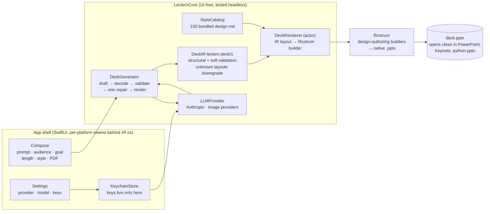

# Lectern

The demo application for **Rostrum** — prove the full loop in one window: a
prompt, optional PDF grounding, a few intent parameters, and one of many bundled
`design.md` styles go in; a native `.pptx` written entirely by Rostrum comes out.
Everything runs on-device except the LLM call. (Section references like §8.3
below cite the internal Lectern spec, which is not part of this repository.)

## Layout

```
Lectern/
├── Package.swift            # LecternCore SPM package (depends on Rostrum via ../)
├── Sources/LecternCore/     # UI-free, fully testable
│   ├── DeckIR/              # lectern.deck/1 IR + validation + repair prompt
│   ├── Export/              # deck → folder: Markdown + media + chart CSVs
│   ├── Inspection/          # deck → counts, findings, digests, previews
│   ├── Providers/           # LLMProvider protocol, DeckGenerator, image providers, errors
│   ├── Rendering/           # DeckRenderer actor → Rostrum builders
│   └── StyleCatalog/        # design.md catalog loader
└── Tests/LecternCoreTests/  # the acceptance core, fixture-backed
```

Rostrum is a **local path dependency** (`../`), resolving OQ-4.

## How a deck gets made



Two invariants anchor the pipeline: **I1** — API keys exist only in the
Keychain (never UserDefaults, never logs, write-only UI); **I3** — nothing
reaches the renderer unvalidated (the IR is checked, repaired at most once,
and unknown layouts downgrade to bullets rather than crash).

## What's built and proven (headless)

`LecternCore` is complete and tested end-to-end against a fixture provider —
the spec's fixture-first M1–M2: *the whole pipeline is proven before a single
real network call*.

- **DeckIR** (`lectern.deck/1`): `Codable` models, structural + soft validation
  (§8.3–8.4), unknown-layout downgrade (§8.5), and the one-shot repair prompt
  (§8.7). Nothing reaches the renderer unvalidated (invariant I3).
- **DeckGenerator**: `draft → decode+validate → one repair → render`.
- **DeckInspector / DeckExporter**: the other direction. The app opens on a
  fork — **Create** or **Inspect** — and Inspect (⌘I) takes any `.pptx`, one
  Lectern made or one that arrived by email, and shows what it is made of:
  counts, geometry, sections, schema findings, a contact sheet of every slide,
  and every word in it. **Export Everything…** then writes a folder holding a
  Markdown file of the deck's words beside a folder per slide with its images,
  movies, sounds and one CSV per chart.

  Every step of that is off the main actor and reports progress — slide
  rendering drives a real `n of N` bar — because opening a large deck and
  drawing every slide is seconds of work, not milliseconds. The extraction
  itself is Rostrum's `DeckOutline`/`DeckExport`; what lives here is the part
  with a user in front of it, and it speaks in `String` and `Int` so the app
  target never needs to link Rostrum.
- **DeckRenderer** (an `actor`, invariant I2): maps each IR layout onto Rostrum's
  design-authoring builders and applies the chosen `design.md`:

  | IR layout | Rostrum builder |
  |---|---|
  | `title` | `titleSlide` |
  | `sectionHeader` | `sectionSlide` |
  | `agenda` / `bullets` | `bulletSlide` |
  | `twoColumn` / `comparison` | `comparisonSlide` |
  | `bigNumber` | `calloutSlide` |
  | `quote` | `quoteSlide` |
  | `closing` | `closingSlide` |
  | `chart` (well-formed data) | `chartSlide` — else bullets fallback |
  | `metrics` | `metricsSlide` |
  | `bands` | `bandsSlide`, or native SmartArt when opted in |
  | `diagram` (process / cycle / pyramid) | `processSlide` / `pyramidSlide`, or SmartArt |
  | `unknown` | downgraded to bullets by validation |

  Styling is `Presentation.applyDesign(contentsOf: design.md)` — **this resolves
  OQ-1**. Sections and speaker notes flow through.
- **FixtureProvider** (tests only): replays a fixture with injectable
  failures, so the whole pipeline is exercised headlessly. The shipping app
  has **no mock path** — generation requires a real key.
- **StyleCatalog**: scans a `design.md` directory into `[Style]`.

**Verified:** the fixture-driven pipeline renders a deck that opens in PowerPoint without
repair (AT-10), with the exact slide count (AT-11), the notes toggle honored
(AT-12), the repair loop recovering once then failing (AT-14), and unknown
layouts downgrading (AT-15). Run it:

```sh
cd Lectern && swift test
```

## The macOS app

The SwiftUI shell (`App/`) is a real macOS app. Its Xcode project is **generated
from `project.yml`** with [xcodegen] — `project.yml` is the checked-in source of
truth; the `.xcodeproj` is a build artifact (gitignored, like `.build/`). No
manual project bookkeeping, no merge conflicts in a pbxproj.

```sh
cd Lectern
xcodegen generate                                              # project.yml → Lectern.xcodeproj
xcodebuild -project Lectern.xcodeproj -scheme Lectern build     # or just open it in Xcode
```

## The iOS/iPadOS app

The same SwiftUI shell builds as a second target, **`Lectern-iOS`** (iPhone +
iPad, iOS/iPadOS 26+, Liquid Glass system components throughout — the same
`.glass`/`.glassProminent` styling as the Mac app). One source tree; the
platform seams live behind `#if os(...)`:

- **Settings** is a sheet behind a toolbar gear (no Settings scene on iOS);
  the macOS quit-guard and window-frame plumbing compile out.
- **Result actions**: Quick Look **Preview** and a **Share** sheet replace
  Open/Reveal-in-Finder. Decks are written to `Documents/Decks` and, via
  `UIFileSharingEnabled` + `LSSupportsOpeningDocumentsInPlace`, appear in the
  **Files** app.
- **Keys** live in the iOS data-protection keychain (same `KeychainStore`,
  no code change needed).
- PDF grounding works via the document picker *and* drag-and-drop from Files
  (iPad); compact widths stack the Compose cards; the style-card favorite
  heart is always visible (no hover on touch).

```sh
cd Lectern
xcodegen generate
scripts/build-ios.sh        # simulator build — ad-hoc signed, no team needed
```

Simulator builds are **ad hoc signed with a minimal entitlements file**
(`App/Lectern-iOS-Sim.entitlements`), not unsigned: a fully unsigned app has
no `application-identifier`, and every Keychain call then fails with
`errSecMissingEntitlement (-34018)` — keys silently refuse to save. To run on
hardware, open the project in Xcode and pick your team under Signing &
Capabilities for `Lectern-iOS`, or from the CLI:

```sh
xcodebuild -scheme Lectern-iOS -destination 'platform=iOS,id=<device-udid>' \
  -allowProvisioningUpdates -allowProvisioningDeviceRegistration \
  DEVELOPMENT_TEAM=<your-team-id> CODE_SIGN_STYLE=Automatic build
xcrun devicectl device install app --device <device-udid> <path>/Lectern.app
```

**Verified:** the app compiles under **Swift 6 complete strict-concurrency**,
bundles all 150 `design.md` styles as an app resource, and launches clean on
macOS, iPadOS, and iOS (simulator and hardware). The Compose → Generating →
Result → Failed state machine (`ContentView`), the `@Observable` `AppState`
driving `DeckGenerator`, the bundled **Style picker** (curated Light/Dark +
vibe filter chips), and Settings are all live — the full prompt-to-PowerPoint
round-trip has been exercised on Mac and iPad with a real key.

[xcodegen]: https://github.com/yonaskolb/XcodeGen

## The local gate

From the repo root, `./scripts/verify.sh` is the full local gate: it runs the
Rostrum and LecternCore suites, the README snippets, both app builds (macOS and
the iOS simulator), and — the part nothing else covers — the **app-hosted
tests** (`Lectern/AppTests`), which exercise `AppState` and the SwiftUI target
that `swift test` never compiles.

CI deliberately does less. Linux runs on every push (Swift 6.0 and 6.1); a
single macOS job runs on pull requests only, because a hosted macOS runner
bills about ten times the Linux rate. Even that job stops at building the app —
nothing in CI ever runs the app-hosted tests. This local gate is where the
Apple side actually gets verified, which is why the pre-push hook matters.

Install the pre-push hook once so every `git push` runs it for you:

```sh
./scripts/install-hooks.sh   # points core.hooksPath at scripts/hooks
```

After that, `git push` runs `./scripts/verify.sh` first and refuses the push if
it fails (`--fast` skips the app builds; `git push --no-verify` bypasses once).

## Settings, keys, and provider selection — done

Keys and provider choice are wired end-to-end (§10 / invariant I1):

- **`KeychainStore`** — API keys live *only* in the login keychain (a
  generic-password item per provider). Never UserDefaults, never logged; the
  `SecureField` is write-only, so a stored key never round-trips through the UI.
- **`SettingsView`** — provider picker + model + key entry, plus optional
  image-provider keys (OpenAI Images / Gemini) for on-brand slide art. The
  field is write-only; a saved key shows a masked "saved" prompt and a green
  Keychain badge instead of ever echoing the secret.
- **`ProviderFactory`** (LecternCore, unit-tested) — the one UI-free place the
  "which provider" decision lives: a stored key for a wired provider → live;
  no key → generation is blocked with a clear message. There is **no mock
  fallback** — Lectern never fabricates a deck. `AppState` persists only the
  non-secret choice (provider/model) and reads key *presence* from the
  Keychain.

## What remains (M3–M5)

- **Live providers** (§7.2): `AnthropicProvider` is written (URLSession, no vendor
  SDK) and selected automatically once a key is stored; OpenAI / Gemini / Custom
  follow the same `LLMProvider` shape. The two-stage outline→deck pipeline and the
  PDF grounding ladder (§7.4) live here. *(The live round-trip needs a real key to
  smoke-test — not exercisable in headless CI.)*
- **History** (SwiftData, §11): persist past decks in the sidebar (currently a
  stub).
- **PriceTable** cost estimate (§10.3) and **Liquid Glass** polish (§3).

The `LLMProvider` protocol, `GenerationEvent` stream, and `LecternError` taxonomy
(§12) are defined, so a new live provider is a drop-in conformance.

## Open items

- **Style catalog source — resolved.** All 150 real `design.md` files ship in
  `App/Resources/Styles/` and are bundled into the app. Every one loads, parses,
  and renders to a PowerPoint-clean deck; the picker selects among them.
  *Provenance:* each style is an original distillation of design *principles*
  (palette, type scale, spacing, mood) observed across real-world sites — no
  copied assets, markup, or imagery. Styles may *name* commercial typefaces;
  no font files are bundled, and PowerPoint substitutes normally when a named
  face isn't installed.
- OQ-3 (final app name), OQ-5 (bundle id/signing) — owner decisions. The
  macOS target builds with a stable Development signing identity (which is
  what lets login-keychain API keys survive rebuilds — see the note in
  `project.yml`); the iOS simulator target signs ad hoc; device builds use
  Xcode automatic signing. Bundle id `com.lectern.app` on both platforms.
