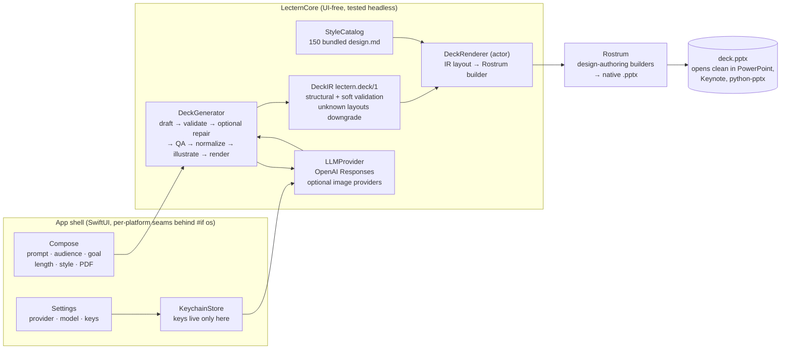

# Lectern

The demo application for **Rostrum** — prove the full loop in one window: a
prompt, optional PDF grounding, a few intent parameters, and one of many bundled
`design.md` styles go in; a native `.pptx` written entirely by Rostrum comes out.
Everything runs on-device except text and optional image-provider calls. (Section references like §8.3
below cite the internal Lectern spec, which is not part of this repository.)

## Layout

```
Lectern/
├── Package.swift            # LecternCore SPM package (depends on Rostrum via ../)
├── Sources/LecternCore/     # UI-free, fully testable
│   ├── DeckIR/              # lectern.deck/1 IR + validation + repair prompt
│   ├── Export/              # deck → folder: Markdown + media + chart CSVs
│   ├── Inspection/          # deck → counts, findings, digests, previews
│   ├── Providers/           # LLMProvider protocol, DeckGenerator, image providers, errors
│   ├── Rendering/           # DeckRenderer actor → Rostrum builders
│   └── StyleCatalog/        # design.md catalog loader
└── Tests/LecternCoreTests/  # the acceptance core, fixture-backed
```

Rostrum is a **local path dependency** (`../`), resolving OQ-4.

## How a deck gets made


```mermaid
flowchart LR
    subgraph Shell["App shell (SwiftUI, per-platform seams behind #if os)"]
        UI["Compose<br/>prompt · audience · goal<br/>length · style · PDF"]
        SET["Settings<br/>provider · model · keys"]
        KC["KeychainStore<br/>keys live only here"]
    end
    subgraph Core["LecternCore (UI-free, tested headless)"]
        GEN["DeckGenerator<br/>draft → validate → optional repair<br/>→ QA → normalize → illustrate → render"]
        IR["DeckIR lectern.deck/1<br/>structural + soft validation<br/>unknown layouts downgrade"]
        REN["DeckRenderer (actor)<br/>IR layout → Rostrum builder"]
        CAT["StyleCatalog<br/>150 bundled design.md"]
        PROV["LLMProvider<br/>OpenAI Responses<br/>optional image providers"]
    end
    R["Rostrum<br/>design-authoring builders<br/>→ native .pptx"]
    OUT[("deck.pptx<br/>opens clean in PowerPoint,<br/>Keynote, python-pptx")]

    UI --> GEN
    SET --> KC
    KC --> PROV
    GEN --> PROV
    PROV --> GEN
    GEN --> IR
    IR --> REN
    CAT --> REN
    REN --> R
    R --> OUT
```

Two invariants anchor the pipeline: **I1** — API keys exist only in the
Keychain (never UserDefaults, never logs, write-only UI); **I3** — nothing
reaches the renderer unvalidated (the IR is checked, repaired at most once,
and unknown layouts downgrade to bullets rather than crash).

## What's built and proven (headless)

`LecternCore` has fixture-backed pipeline tests. They verify deterministic
behavior without paid calls; they do not establish live provider quality or
PowerPoint acceptance for every output. The source and tests below are the
repository's executable contract; internal spec references are historical context.

- **DeckIR** (`lectern.deck/1`): `Codable` models, structural + soft validation
  (§8.3–8.4), unknown-layout downgrade (§8.5), and the one-shot repair prompt
  (§8.7). Nothing reaches the renderer unvalidated (invariant I3).
- **DeckGenerator**: draft → decode/validate → at most one repair if needed →
  optional QA revision → normalize/revalidate → optional illustrations → render.
  A failed or structurally invalid QA revision keeps the validated draft.
- **DeckInspector / DeckExporter**: the other direction. The app opens on a
  fork — **Create** or **Inspect** — and Inspect (⌘I) takes any `.pptx`, one
  Lectern made or one that arrived by email, and shows what it is made of:
  counts, geometry, sections, schema findings, a contact sheet of every slide,
  and every word in it. **Export Everything…** then writes a folder holding a
  Markdown file of the deck's words beside a folder per slide with its images,
  movies, sounds and one CSV per chart.

  Every step of that is off the main actor and reports progress — slide
  rendering drives a real `n of N` bar — because opening a large deck and
  drawing every slide is seconds of work, not milliseconds. The extraction
  itself is Rostrum's `DeckOutline`/`DeckExport`; what lives here is the part
  with a user in front of it, and it speaks in `String` and `Int` so the app
  target never needs to link Rostrum.
- **DeckRenderer** (an `actor`, invariant I2): maps each IR layout onto Rostrum's
  design-authoring builders and applies the chosen `design.md`:

  | IR layout | Rostrum builder |
  |---|---|
  | `title` | `titleSlide` |
  | `sectionHeader` | `sectionSlide` |
  | `agenda` / `bullets` | `bulletSlide` |
  | `twoColumn` / `comparison` | `comparisonSlide` |
  | `bigNumber` | `calloutSlide` |
  | `quote` | `quoteSlide` |
  | `closing` | `closingSlide` |
  | `chart` (well-formed data) | `chartSlide` — else bullets fallback |
  | `metrics` | `metricsSlide` |
  | `bands` | `bandsSlide`, or native SmartArt when opted in |
  | `diagram` (process / cycle / pyramid) | `processSlide` / `pyramidSlide`, or SmartArt |
  | `unknown` | downgraded to bullets by validation |

  Styling is `Presentation.applyDesign(contentsOf: design.md)` — **this resolves
  OQ-1**. Sections and speaker notes flow through.
- **FixtureProvider** (tests only): replays a fixture with injectable
  failures, so the whole pipeline is exercised headlessly. The shipping app
  has **no mock path** — generation requires a real key.
- **StyleCatalog**: scans a `design.md` directory into `[Style]`.

**Verified:** the fixture-driven pipeline renders a deck that opens in PowerPoint without
repair (AT-10), with the exact slide count (AT-11), the notes toggle honored
(AT-12), the repair loop recovering once then failing (AT-14), and unknown
layouts downgrading (AT-15). Run it:

```sh
cd Lectern && swift test
```

## The macOS app

Inspection keeps every original slide position, showing a numbered placeholder
when a preview fails. Contact sheets and filmstrips retain the deck's aspect
ratio, including 4:3 and portrait. macOS bitmap previews share one WebKit host
and a bounded cache whose keys include rendering dimensions. See the
[preview and performance checks](../Tools/rostrum-benchmark/README.md) for
reproducible snapshots and timing measurements.

The SwiftUI shell (`App/`) is a real macOS app. Its Xcode project is **generated
from `project.yml`** with [xcodegen] — `project.yml` is the checked-in source of
truth; the `.xcodeproj` is a build artifact (gitignored, like `.build/`). No
manual project bookkeeping, no merge conflicts in a pbxproj.

```sh
cd Lectern
scripts/build.sh       # generates the project as needed; honors .signing.local
scripts/test-app.sh    # app-hosted tests, with the same signing configuration
```

## The iOS/iPadOS app

The same SwiftUI shell builds as a second target, **`Lectern-iOS`** (iPhone +
iPad, iOS/iPadOS 26+, Liquid Glass system components throughout — the same
`.glass`/`.glassProminent` styling as the Mac app). One source tree; the
platform seams live behind `#if os(...)`:

- **Settings** is a sheet behind a toolbar gear (no Settings scene on iOS);
  the macOS quit-guard and window-frame plumbing compile out.
- **Result actions**: Quick Look **Preview** and a **Share** sheet replace
  Open/Reveal-in-Finder. Decks are written to `Documents/Decks` and, via
  `UIFileSharingEnabled` + `LSSupportsOpeningDocumentsInPlace`, appear in the
  **Files** app.
- **Keys** live in the iOS data-protection keychain (same `KeychainStore`,
  no code change needed).
- PDF grounding works via the document picker *and* drag-and-drop from Files
  (iPad); compact widths stack the Compose cards; the style-card favorite
  heart is always visible (no hover on touch).

```sh
cd Lectern
xcodegen generate
scripts/build-ios.sh        # simulator build — ad-hoc signed, no team needed
```

Simulator builds are **ad hoc signed with a minimal entitlements file**
(`App/Lectern-iOS-Sim.entitlements`), not unsigned: a fully unsigned app has
no `application-identifier`, and every Keychain call then fails with
`errSecMissingEntitlement (-34018)` — keys silently refuse to save. To run on
hardware, open the project in Xcode and pick your team under Signing &
Capabilities for `Lectern-iOS`, or from the CLI:

```sh
xcodebuild -scheme Lectern-iOS -destination 'platform=iOS,id=<device-udid>' \
  -allowProvisioningUpdates -allowProvisioningDeviceRegistration \
  DEVELOPMENT_TEAM=<your-team-id> CODE_SIGN_STYLE=Automatic build
xcrun devicectl device install app --device <device-udid> <path>/Lectern.app
```

**Verified:** the app compiles under **Swift 6 complete strict-concurrency**,
bundles all 150 `design.md` styles as an app resource, and launches clean on
macOS, iPadOS, and iOS (simulator and hardware). The Compose → Generating →
Result → Failed state machine (`ContentView`), the `@Observable` `AppState`
driving `DeckGenerator`, the bundled **Style picker** (curated Light/Dark +
vibe filter chips), and Settings are all live — the full prompt-to-PowerPoint
round-trip has been exercised on Mac and iPad with a real key.

[xcodegen]: https://github.com/yonaskolb/XcodeGen

## The local gate

From the repo root, `./scripts/verify.sh` is the full local gate: it runs the
Rostrum and LecternCore suites, the README snippets, both app builds (macOS and
the iOS simulator), and — the part nothing else covers — the **app-hosted
tests** (`Lectern/AppTests`), which exercise `AppState` and the SwiftUI target
that `swift test` never compiles.

CI deliberately does less. Linux runs on every push (Swift 6.0 and 6.1); a
single macOS job runs on pull requests only, because a hosted macOS runner
bills about ten times the Linux rate. Even that job stops at building the app —
nothing in CI ever runs the app-hosted tests. This local gate is where the
Apple side actually gets verified, which is why the pre-push hook matters.

Install the pre-push hook once so every `git push` runs it for you:

```sh
./scripts/install-hooks.sh   # points core.hooksPath at scripts/hooks
```

After that, `git push` runs `./scripts/verify.sh` first and refuses the push if
it fails (`--fast` skips the app builds; `git push --no-verify` bypasses once).

## Settings, keys, and provider selection — done

Keys and provider choice are wired end-to-end (§10 / invariant I1):

- **`KeychainStore`** — API keys live *only* in the login keychain (a
  generic-password item per provider). Never UserDefaults, never logged; the
  `SecureField` is write-only, so a stored key never round-trips through the UI.
- **`SettingsView`** — OpenAI text strength (Astra, Sol, Luna), reasoning effort,
  image model (Sunburst, Flare), and image quality dropdowns. Optional image
  generation has its own OpenAI key entry; it may use the same key as text. The
  field is write-only; a saved key shows a masked "saved" prompt and a green
  Keychain badge instead of ever echoing the secret.
- **`ProviderFactory`** (LecternCore, unit-tested) — the one UI-free place the
  "which provider" decision lives: a stored key for a wired provider → live;
  no key → generation is blocked with a clear message. There is **no mock
  fallback** — Lectern never fabricates a deck. `AppState` persists only the
  non-secret choice (provider/model) and reads key *presence* from the
  Keychain.

## Implemented behavior and remaining work

- Generation uses OpenAI only: Astra (`gpt-6-astra`), Sol (`gpt-6.1-sol`), and
  Luna (`gpt-6-luna`) through `/v1/responses`; Sunburst
  (`gpt-image-2.5-sunburst`) and Flare (`gpt-image-2.5-flare`) through the Images API.
  Defaults are Sol / medium reasoning and Flare / automatic image quality.
  Text supports low, medium, high, extra high, and maximum effort; Luna also
  supports none. Switching from Luna / none to another model selects low.
  All choices persist and apply to draft, repair, and editorial passes.
- Old provider/model preferences migrate to these defaults. Existing OpenAI
  Keychain entries are reused; other vendors' keys are never copied or deleted.
  Legacy provider enum values remain for decoding existing records.
- OpenAI requests use `store: false`, the existing untrusted-input contract,
  forced `emit_deck` function calls, validation and repair. Output budgets reserve
  additional room for reasoning. Higher effort can take longer and cost more.
- Image sizes preserve each requested aspect ratio, including exact 16:9 slide
  backgrounds. Style and background/panel art direction remain shared.
- Model capabilities were checked against the [OpenAI model catalog](https://developers.openai.com/api/docs/models)
  on October 2, 2026. Model availability still depends on the API project.
- `Storage/DeckLibrary.swift` and `App/AppState.swift` load, rename and delete
  saved deck files. This is a file-backed library, not a pending SwiftData store.
- `Providers/PriceTable.swift` supplies estimates displayed by AppState. These
  are historical estimates, not a provider billing reconciliation. The new
  reasoning models have no preflight dollar estimate: reasoning and image usage
  vary, and Lectern does not substitute a legacy model's price.
- Generation cancellation is available in ContentView and invalidates the
  active RunGate before cancelling its task. Tests cover stale run rejection.
- Live model quality and PowerPoint fidelity still need sample-based inspection;
  fixture tests cannot substitute for those checks. See ROADMAP.md for other
  deliberate deferrals rather than treating the original M3–M5 plan as current.

## Open items

- **Style catalog source — resolved.** All 150 real `design.md` files ship in
  `App/Resources/Styles/` and are bundled into the app. Every one loads, parses,
  and renders to a PowerPoint-clean deck; the picker selects among them.
  *Provenance:* each style is an original distillation of design *principles*
  (palette, type scale, spacing, mood) observed across real-world sites — no
  copied assets, markup, or imagery. Styles may *name* commercial typefaces;
  no font files are bundled, and PowerPoint substitutes normally when a named
  face isn't installed.
- OQ-3 (final app name), OQ-5 (bundle id/signing) — owner decisions. The
  macOS target builds with a stable Development signing identity (which is
  what lets login-keychain API keys survive rebuilds — see the note in
  `project.yml`); the iOS simulator target signs ad hoc; device builds use
  Xcode automatic signing. Bundle id `com.lectern.app` on both platforms.

## PowerPoint templates and layout composition

In Compose, choose **Use PowerPoint template** in the Design card and select a
`.potx`. Lectern snapshots the file, lists its masters/layout counts, and lets you
select a master or use all masters. **Use theme instead** returns to the design.md
catalog. Template generation uses the template's page size, layout geometry,
typography, colors and artwork; the selected design.md does not override it.
Exports retain the template library, including every used master and layout.

The generator supplies concise content to `RostrumLayout`. Text occupies inherited
placeholders; charts and tables are native editable objects. Generated images are
inserted only when the selected layout offers a picture placeholder. Missing picture
slots and conversion of structured content to template text produce warnings. Metrics,
diagrams, timelines, quadrants and bands currently become text within native template
content regions; they are not reconstructed as native diagrams. Wrapped text uses safe
space below its placeholder when the template allows flow. Template shrink-to-fit
settings use native font scaling without replacing inherited fonts. Neither operation
changes the template's master or layout parts. Content that still cannot fit stops
export with an error instead of overflowing the slide. Missing or unmeasured
fonts remain visible in the result's diagnostics.

Chart and table explanations and sources reserve their measured wrapped height before
layout selection; they are not squeezed into a fixed caption strip. If no layout can
fit both a readable object and its explanation, the full text continues on following
template slides. Section membership and speaker notes are retained, and the result
reports the added slides. Export failures
retain the final normalized draft in the protected diagnostics folder, using the same
seven-day retention policy as rejected drafts, so it can be replayed without another
model request.

Template selection prefers layouts with the appropriate number of content regions
and enough usable area. Table rows are measured with their cell padding before
placing captions; generated diagrams fit wholly inside picture placeholders instead
of being cropped. Imported master/layout/theme parts remain unchanged.

Theme-based generation compiles design.md into the master/theme and publishes a
subordinate layout for each authored composition. Header dividers follow the measured
title band, body text gets the remaining region, and photo backgrounds use contrasting
text including footers. Dense text, image and comparison slides continue onto additional
pages at readable sizes. Long sources flow onto source-note pages. The final fit pass
can compact spacing and reduce body type to 17pt; unsupported content that still cannot
fit produces an explicit error.

Recovery previews show the revised slide count and layout adjustments. Recomposition
preserves other slides and existing review comments. **Rebuild the entire deck from
saved content** allows the page count to change freely in a new copy; later manual
edits and comments remain only in the original file.

Local acceptance evidence and the supplied-template test deck are recorded in
`audit/template-acceptance/`. Structural success is separate from PowerPoint visual
acceptance. To isolate a build from a running app, the macOS build and test wrappers
accept `LECTERN_DERIVED_DATA_PATH`; app-hosted tests also need a distinct bundle ID
when the original Lectern must stay running.
