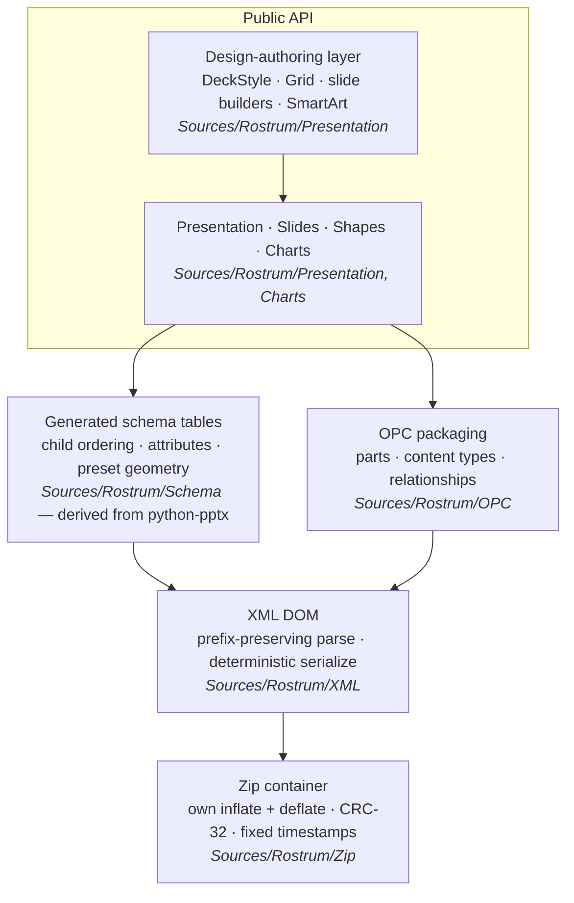
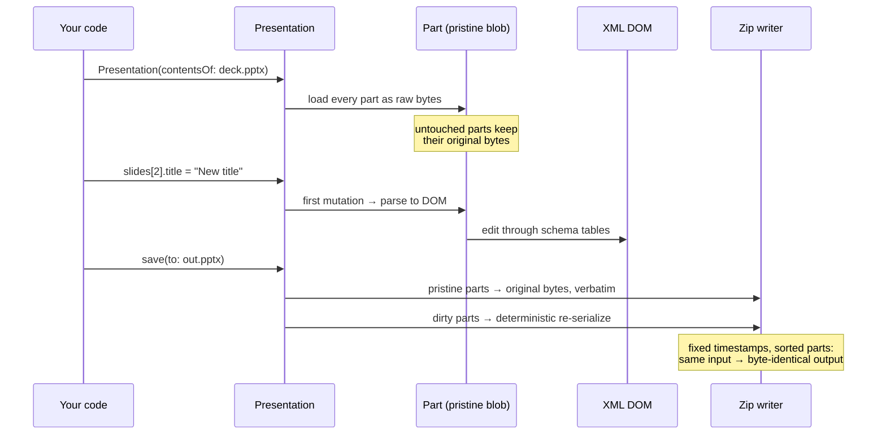

# Rostrum

[](https://github.com/welshofer/rostrum/actions/workflows/ci.yml)
[](https://swift.org)
[](#install)
[](LICENSE)

A **pure-Swift, zero-dependency** library for creating and editing PowerPoint
(`.pptx`) files. Rostrum owns its entire stack — from the zip container and a
hand-written DEFLATE codec, up through OPC packaging and the PresentationML
object model. It runs anywhere Swift runs: **macOS, iOS, Linux**.

Rostrum is a ground-up Swift port of
[python-pptx](https://github.com/scanny/python-pptx), whose design it follows
closely and gratefully — the layered architecture, the API shape, and the
encoded schema knowledge all trace back to that project. On that foundation
Rostrum adds capabilities outside python-pptx's current scope: slide
**remove / move / duplicate**, **modern threaded comments**, **SmartArt**
creation and text extraction, **deck merge**, **theme / brand-kit editing**,
and lossless byte-identical round-trips of the parts you don't touch.

```swift
import Foundation
import Rostrum

let deck = try Presentation()                       // starts with one blank 16:9 slide
let slide = try deck.slides.add(layout: deck.layout(type: "title")!)
slide.title?.textFrame?.text = "Hello, Rostrum"
try deck.slides.remove(at: 0)                       // drop the blank starter slide
try deck.save(to: URL(filePath: "hello.pptx"))
```

### …or the design-authoring layer

Open a brand template, apply a `design.md`, and build a whole deck from one-call,
auto-laid-out builders — on-brand, no placeholder plumbing:

```swift
import Foundation
import Rostrum

let deck = try Presentation()   // or open your brand template: Presentation(contentsOf: URL(filePath: "brand.potx"))
deck.applyDesign(try Design(contentsOf: URL(filePath: "sunflower.md")))

let arr = ChartData(categories: ["Q1", "Q2", "Q3", "Q4"],
                    series: [ChartData.Series(name: "ARR", values: [12.1, 14.6, 16.8, 18.4])])

try deck.titleSlide("Q3 Business Review", subtitle: "Northwind", kicker: "FY26")
try deck.bulletSlide("Highlights", ["ARR $18.4M", "Retention 91%", "NPS 47"], kicker: "Results")
try deck.chartSlide("Revenue", .line, arr, options: ChartOptions(legend: .bottom))
try deck.setSections([("Cover", 0), ("The Quarter", 1)])
try deck.footer("Confidential").showSlideNumbers()
try deck.slides.remove(at: 0)   // drop the blank starter slide
try deck.save(to: URL(filePath: "review.pptx"))
```

(A ready-made `sunflower.md` ships in `Lectern/App/Resources/Styles/`, along
with 149 more.)

More recipes in the [cookbook](docs/COOKBOOK.md).

## Install

Swift Package Manager:

```swift
.package(url: "https://github.com/welshofer/rostrum", from: "0.3.0")
```

then add `"Rostrum"` to your target's dependencies.

> **Pre-1.0**: Rostrum follows SemVer, but until 1.0 minor versions may
> change API. Pin a version if you need stability; see
> [`CHANGELOG.md`](CHANGELOG.md) for what moved.

## What it can do

| Area | Highlights |
|---|---|
| **Slides** | add, remove, **move, duplicate**, layouts & placeholder inheritance |
| **Shapes** | 178 preset geometries, rounded rects (pill corners), transforms, rotation |
| **Fills & lines** | solid, alpha, multi-stop gradients, outlines, soft shadows |
| **Text** | paragraphs, runs, fonts, sizes, colours, alignment, spacing, tracking, **bullets, numbered lists, hyperlinks** |
| **Pictures** | PNG/JPEG/GIF sniffing, content dedup, natural sizing, **cover-crop (`fit: .fill`)**, alt text |
| **Tables** | grid, cell fills & anchors, merge, banded rows |
| **Charts** | bar / line / pie / area / doughnut / scatter / **radar / bubble / combo**, stacked & multi-series, titles, **data labels**, axis control, embedded Edit-Data workbook |
| **Chart editing** | `deck.charts` reads any deck's charts; `replaceData` swaps every cache and the workbook or **refuses without writing a byte**; `addSeries` / `removeSeries` |
| **Rendering** | `renderSVG(slideAt:)` / `exportSVG` — headless slide→SVG previews with real font metrics, master/layout inheritance, no platform text stack |
| **SmartArt** | Basic Block List creation; **text extraction from any diagram** |
| **Comments** | modern threaded comments, replies, resolve |
| **Notes** | per-slide speaker notes |
| **Fonts** | **embed TTF/OTF** so a deck renders identically everywhere; **parse font metrics** (pure Swift, zero deps) to measure text |
| **Text fitting** | `shape.fitText(using:)` — measure with real font metrics and write a **computed `normAutofit`**, so text provably fits its box (python-pptx's `fit_text` can't) |
| **Theme** | read/edit palette & fonts; resolve `schemeClr` → RGB |
| **Merge** | import a slide from another deck with its images, charts and layout intact |
| **Design layer** | `DeckStyle` (type scale, WCAG auto-contrast, tokens); one-call slide builders; cards/buttons/kickers/stat tiles; a Grid DSL |
| **Templates** | open a `.potx`/`.ppsx` directly and round-trip it as one; `documentKind` converts when you want a deck out of a template; drive styling from a `design.md` (fonts, palette, spacing/radius/type tokens) |
| **Sections** | native PowerPoint sections; footers, slide numbers, dates via live fields |
| **Extraction** | `deck.outline()` — every slide's text (title, subtitle, bullets with outline level, table cells, SmartArt, notes) as a value type; `DeckExport.write` unpacks a deck to a folder: one Markdown file plus per-slide media and one CSV per chart |
| **Tooling** | `pptx-tool inspect`/`validate` — machine-checkable "PowerPoint will accept this" gate; `pptx-tool extract` — a deck to Markdown + media + chart CSVs |

## Design

Rostrum is a **pristine-DOM hybrid**: a mutable XML DOM is the storage layer,
and parts keep their **original bytes until first mutation**, which makes
lossless round-trips a structural guarantee rather than an aspiration. Typed
Swift facades read and write through to the DOM, with schema-ordering tables
mechanically extracted from python-pptx's own declarations
(`Tools/rostrum-gen`). Full rationale in
[`docs/ARCHITECTURE.md`](docs/ARCHITECTURE.md); roadmap in
[`ROADMAP.md`](ROADMAP.md).

Layers, bottom to top (dependencies point strictly downward — Zip knows
bytes, XML knows trees, OPC knows parts and never slides):



| Layer | Location | python-pptx counterpart |
|---|---|---|
| Zip container (read/write, own inflate + deflate) | `Sources/Rostrum/Zip` | Python's `zipfile` |
| XML DOM (parse/serialize, prefix-preserving) | `Sources/Rostrum/XML` | `lxml` |
| OPC packaging (parts, content types, relationships) | `Sources/Rostrum/OPC` | `pptx.opc` |
| Generated schema tables | `Sources/Rostrum/Schema` | `pptx.oxml` descriptors |
| PresentationML object model | `Sources/Rostrum/Presentation`, `Charts` | `pptx.parts` + API |

And the life of a document — the pristine-DOM hybrid at work:



## Examples

Runnable sample decks live in `Examples/`, each emitted entirely in Swift and
each with a job:

| Example | Slides | What it shows |
|---|---|---|
| `ClimateDeck` | 15 | The showpiece — a data-driven briefing: stat callouts, charts, a full visual system |
| `FlexDeck` | 13 | The API tour — one capability per slide (charts, process, cards, comments, SmartArt…) |
| `SunflowerDeck` | 30 | A production-scale illustrated deck; pass an images directory for full-bleed photography |
| `ReadmeSnippets` | — | This README's two code snippets, compiled and run by CI so the docs can't rot |

```sh
swift run ClimateDeck out.pptx
swift run SunflowerDeck out.pptx path/to/images
swift run ReadmeSnippets            # writes hello.pptx + review.pptx
```

## Verification

Rostrum is checked three ways: unit tests against external oracles
(`unzip -t`, `zlib`), reopening its own output, and — the strictest — a
scripted **PowerPoint double-click open** (`Tools/ppt-check.sh`) that catches
integrity errors other tools tolerate.

## Acknowledgments

Rostrum exists because [python-pptx](https://github.com/scanny/python-pptx)
exists. Steve Canny's library is the canonical map of the PresentationML
territory — a decade of careful schema archaeology that this project ports
rather than rediscovers. Rostrum's schema tables are mechanically derived
from python-pptx's declarations (see
[`THIRD_PARTY_LICENSES.md`](THIRD_PARTY_LICENSES.md)), and python-pptx
remains one of Rostrum's release oracles: a deck isn't considered valid until
python-pptx opens it cleanly. If you work in Python, use python-pptx — it is
mature, battle-tested, and excellent.

## License

[MIT](LICENSE). Portions derived from python-pptx (MIT, © Steve Canny) — see
[`THIRD_PARTY_LICENSES.md`](THIRD_PARTY_LICENSES.md). Contributions welcome —
see [`CONTRIBUTING.md`](CONTRIBUTING.md).
