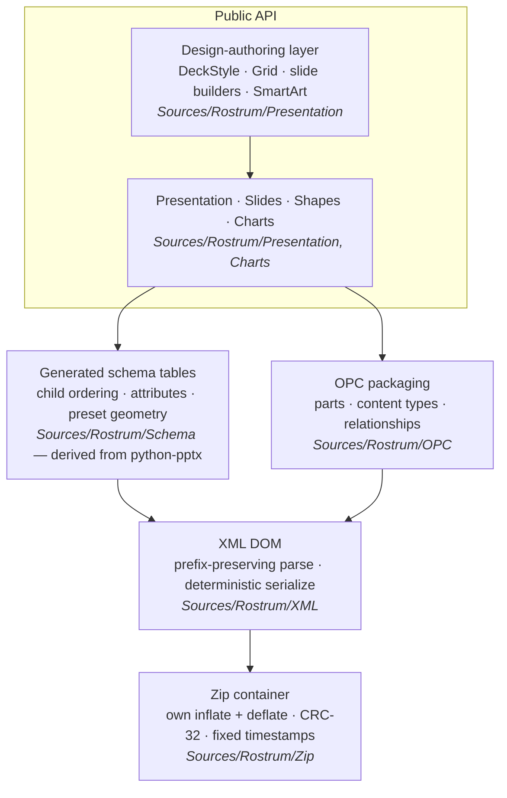
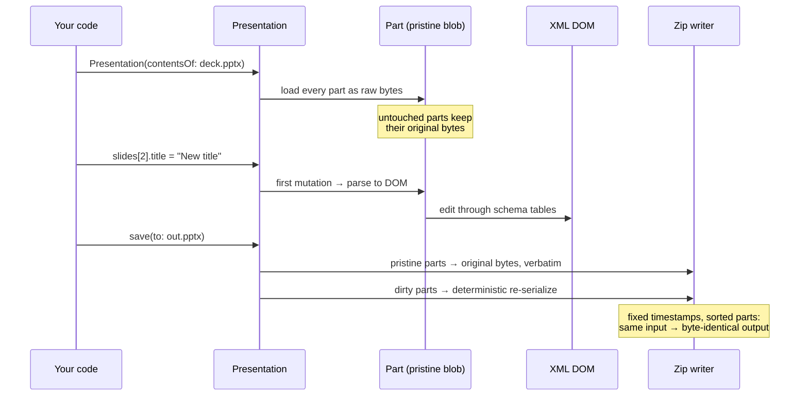

# Rostrum

[](https://github.com/welshofer/rostrum/actions/workflows/ci.yml)
[](https://swift.org)
[](#install)
[](LICENSE)

A **pure-Swift, zero-dependency** library for creating and editing PowerPoint
(`.pptx`) files. Rostrum owns its entire stack — from the zip container and a
hand-written DEFLATE codec, up through OPC packaging and the PresentationML
object model. It runs anywhere Swift runs: **macOS, iOS, Linux**.

Rostrum is a ground-up Swift port of
[python-pptx](https://github.com/scanny/python-pptx), whose design it follows
closely and gratefully — the layered architecture, the API shape, and the
encoded schema knowledge all trace back to that project. On that foundation
Rostrum adds capabilities outside python-pptx's current scope: slide
**remove / move / duplicate**, **modern threaded comments**, **SmartArt**
creation and text extraction, **deck merge**, **theme / brand-kit editing**,
and lossless byte-identical round-trips of the parts you don't touch.

<!-- snippet:quickStart -->
```swift
import Foundation
import Rostrum

let deck = try Presentation()                       // starts with one blank 16:9 slide
let slide = try deck.slides.add(clonedFrom: deck.layout(type: "title")!)
slide.title?.textFrame?.text = "Hello, Rostrum"
try deck.slides.remove(at: 0)                       // drop the blank starter slide
try deck.save(to: URL(filePath: "hello.pptx"))
```
<!-- /snippet:quickStart -->

### …or the design-authoring layer

Open a brand template, apply a `design.md`, and build a whole deck from one-call,
auto-laid-out builders — on-brand, no placeholder plumbing:

<!-- snippet:designAuthoring -->
```swift
import Foundation
import Rostrum

let deck = try Presentation()   // or open your brand template: Presentation(contentsOf: URL(filePath: "brand.potx"))
deck.applyDesign(try Design(contentsOf: URL(filePath: "sunflower.md")))

let arr = ChartData(categories: ["Q1", "Q2", "Q3", "Q4"],
                    series: [ChartData.Series(name: "ARR", values: [12.1, 14.6, 16.8, 18.4])])

try deck.titleSlide("Q3 Business Review", subtitle: "Northwind", kicker: "FY26")
try deck.bulletSlide("Highlights", ["ARR $18.4M", "Retention 91%", "NPS 47"], kicker: "Results")
try deck.chartSlide("Revenue", .line, arr, options: ChartOptions(legend: .bottom))
try deck.setSections([("Cover", 0), ("The Quarter", 1)])
try deck.footer("Confidential").showSlideNumbers()
try deck.slides.remove(at: 0)   // drop the blank starter slide
try deck.save(to: URL(filePath: "review.pptx"))
```
<!-- /snippet:designAuthoring -->

(A ready-made `sunflower.md` ships in `Lectern/App/Resources/Styles/`, along
with 149 more.)

More recipes in the [cookbook](docs/COOKBOOK.md).

## Imported presentation fidelity

The current `main` branch includes a major preview and layout update: custom
DrawingML curves, saved SmartArt drawings, bounded SVG artwork, inherited text
and list formatting, corrected anchored text, and an explicit measured fallback
for unavailable fonts. Native glyph placement, bounded mixed-font spacing and
list-marker corrections, live table fitting, and native table defaults/border
joins extend the shared engine. Later updates add partial custom-style defaults,
bounded border transitions and selected image-fill ownership in inspection and
export. Source font names and untouched package content remain
preserved. These changes are **Unreleased**; the versioned installation below
does not imply that version 0.4.0 includes them. Pin a reviewed commit revision
when consuming these changes before the next release.

The [layout-engine guide](docs/LAYOUT-ENGINE.md) explains shared text measurement,
native glyph placement, table context, template selection, pagination and caches.

Start with [Importing and previewing](docs/IMPORTING-AND-PREVIEWING.md) for font
registration, fallback policy, diagnostics and acceptance checks. The
[acceptance record](docs/IMPORTED-FIDELITY-20261003.md) covers native PowerPoint
comparisons and a 22-slide iOS consumer review. A scoped Release benchmark
measured **16.5% lower warm full-deck SVG rendering time** at the optimization
checkpoint; see [performance measurements](docs/PERFORMANCE.md) for scope and
limits. Neither result claims universal PowerPoint equivalence.

## Install

Swift Package Manager:

```swift
.package(url: "https://github.com/welshofer/rostrum", from: "0.4.0")
```

then add `"Rostrum"` to your target's dependencies.

> **Pre-1.0**: Rostrum follows SemVer, but until 1.0 minor versions may
> change API. Pin a version if you need stability; see
> [`CHANGELOG.md`](CHANGELOG.md) for what moved.

## What it can do

| Area | Highlights |
|---|---|
| **Slides** | add, remove, **move, duplicate**, layouts & placeholder inheritance |
| **Shapes** | 178 preset geometries for authoring; bounded custom line/curve previews, transforms, rotation and hidden-shape handling |
| **Fills & lines** | solid, alpha, multi-stop gradients, outlines, soft shadows |
| **Text** | paragraphs, runs, fonts, sizes, colours, alignment, spacing, tracking, **bullets, numbered lists, hyperlinks** |
| **Pictures** | PNG/JPEG/GIF sniffing, content dedup, crop read/edit, isolated replacement, stretch/tile mapping, picture rotation/reflection and geometry clipping |
| **Tables** | merge inspection/unmerge, row/column insertion, removal and reordering, edge/diagonal borders, padding, image fills, embedded/custom style resolution |
| **Charts** | bar / line / pie / area / doughnut / scatter / **radar / bubble / combo**, stacked & multi-series, titles, **data labels**, axis control, embedded Edit-Data workbook |
| **Chart editing** | `deck.charts` reads any deck's charts; `replaceData` swaps every cache and the workbook or **refuses without writing a byte**; `addSeries` / `removeSeries` |
| **Rendering** | `renderSVG(slideAt:)` / `exportSVG` — deterministic SVG previews with shared rich-text layout and master/layout inheritance; structured fidelity reports and opt-in `strictRendering` reject known gaps |
| **SmartArt** | Basic Block List creation; **text extraction from any diagram**; bounded preview of saved drawing caches |
| **Comments** | modern threads/replies, text editing, resolve/reopen/delete, slide/shape/text anchors; legacy comment read/create/edit/delete |
| **Notes** | rich speaker notes, independent duplicates, source notes-master preservation on import; bounded notes-page SVG previews with fidelity diagnostics; incompatible masters are refused atomically |
| **Fonts** | distinct regular/bold/italic faces, TTF/OTF embedding, bounded Swift kerning/ligature shaping with diagnostics for unsupported scripts; permitted registered fonts are embedded in SVG; explicit measured preview fallback with missing-font diagnostics |
| **Text fitting** | `shape.fitText(fonts: deck.fonts)` — shared mixed-run layout measures registered faces and writes computed `normAutofit`; inspect `renderSVGReportingProblems` for unsupported script/layout cases |
| **Theme** | read/edit palette & fonts; resolve `schemeClr` → RGB |
| **Merge** | import a slide from another deck with its images, charts and layout intact |
| **Design layer** | `DeckStyle` (type scale, WCAG auto-contrast, tokens); one-call slide builders; cards/buttons/kickers/stat tiles; a Grid DSL |
| **Templates** | lossless `.potx`/`.ppsx` round-trip; `Presentation.fromTemplate(data:)` creates a new deck retaining masters, layouts, themes and their assets; `RostrumLayout` fills inherited placeholders and checks fit; `design.md` can compile into a native master and subordinate layouts |
| **Extraction** | `deck.outline()` — every slide's text (title, subtitle, bullets with outline level, table cells, SmartArt, notes) as a value type; `DeckExport.write` unpacks a deck to a folder: one Markdown file plus per-slide media and one CSV per chart |
| **Sections** | native sections, membership maintained across slide lifecycle operations, section removal/reordering; footers, slide numbers, dates via live fields |
| **Tooling** | `pptx-tool inspect`/`validate` — schema lint; `extract` — Markdown + media + chart CSVs; `render` — SVG with fidelity diagnostics and `--strict`; separate Office/visual conformance gates |

Read/edit/preservation support and preview fidelity are separate claims. See the
[operation-level conformance matrix](docs/CONFORMANCE.md) for evidence and open
acceptance gaps. Animation is outside the current accuracy/performance work.

## Design

Rostrum is a **pristine-DOM hybrid**: a mutable XML DOM is the storage layer,
and parts keep their **original bytes until first mutation**, which makes
lossless round-trips a structural guarantee rather than an aspiration. Typed
Swift facades read and write through to the DOM, with schema-ordering tables
mechanically extracted from python-pptx's own declarations
(`Tools/rostrum-gen`). Full rationale in
[`docs/ARCHITECTURE.md`](docs/ARCHITECTURE.md); roadmap in
[`ROADMAP.md`](ROADMAP.md).

Layers, bottom to top (dependencies point strictly downward — Zip knows
bytes, XML knows trees, OPC knows parts and never slides):


```mermaid
flowchart TB
    subgraph API["Public API"]
        P["Presentation · Slides · Shapes · Charts<br/><i>Sources/Rostrum/Presentation, Charts</i>"]
        D["Design-authoring layer<br/>DeckStyle · Grid · slide builders · SmartArt<br/><i>Sources/Rostrum/Presentation</i>"]
    end
    S["Generated schema tables<br/>child ordering · attributes · preset geometry<br/><i>Sources/Rostrum/Schema</i> — derived from python-pptx"]
    O["OPC packaging<br/>parts · content types · relationships<br/><i>Sources/Rostrum/OPC</i>"]
    X["XML DOM<br/>prefix-preserving parse · deterministic serialize<br/><i>Sources/Rostrum/XML</i>"]
    Z["Zip container<br/>own inflate + deflate · CRC-32 · fixed timestamps<br/><i>Sources/Rostrum/Zip</i>"]

    D --> P
    P --> S
    P --> O
    S --> X
    O --> X
    X --> Z
```

| Layer | Location | python-pptx counterpart |
|---|---|---|
| Zip container (read/write, own inflate + deflate) | `Sources/Rostrum/Zip` | Python's `zipfile` |
| XML DOM (parse/serialize, prefix-preserving) | `Sources/Rostrum/XML` | `lxml` |
| OPC packaging (parts, content types, relationships) | `Sources/Rostrum/OPC` | `pptx.opc` |
| Generated schema tables | `Sources/Rostrum/Schema` | `pptx.oxml` descriptors |
| PresentationML object model | `Sources/Rostrum/Presentation`, `Charts` | `pptx.parts` + API |

And the life of a document — the pristine-DOM hybrid at work:


```mermaid
sequenceDiagram
    participant U as Your code
    participant P as Presentation
    participant Part as Part (pristine blob)
    participant DOM as XML DOM
    participant Zip as Zip writer

    U->>P: Presentation(contentsOf: deck.pptx)
    P->>Part: load every part as raw bytes
    Note over Part: untouched parts keep<br/>their original bytes
    U->>P: slides[2].title = "New title"
    P->>Part: first mutation → parse to DOM
    Part->>DOM: edit through schema tables
    U->>P: save(to: out.pptx)
    P->>Zip: pristine parts → original bytes, verbatim
    P->>Zip: dirty parts → deterministic re-serialize
    Note over Zip: fixed timestamps, sorted parts:<br/>same input → byte-identical output
```

## Examples

Runnable sample decks live in `Examples/`, each emitted entirely in Swift and
each with a job:

| Example | Slides | What it shows |
|---|---|---|
| `ClimateDeck` | 15 | The showpiece — a data-driven briefing: stat callouts, charts, a full visual system |
| `FlexDeck` | 13 | The API tour — one capability per slide (charts, process, cards, comments, SmartArt…) |
| `SunflowerDeck` | 30 | A production-scale illustrated deck; pass an images directory for full-bleed photography |
| `ReadmeSnippets` | — | This README's two code snippets, compiled and run by CI so the docs can't rot |

```sh
swift run ClimateDeck out.pptx
swift run SunflowerDeck out.pptx path/to/images
swift run ReadmeSnippets            # writes hello.pptx + review.pptx
```

## Verification

Rostrum is checked three ways: unit tests against external oracles
(`unzip -t`, `zlib`), reopening its own output, and — the strictest — a
scripted **PowerPoint double-click open** (`Tools/ppt-check.sh`) that catches
integrity errors other tools tolerate.

## Acknowledgments

Rostrum exists because [python-pptx](https://github.com/scanny/python-pptx)
exists. Steve Canny's library is the canonical map of the PresentationML
territory — a decade of careful schema archaeology that this project ports
rather than rediscovers. Rostrum's schema tables are mechanically derived
from python-pptx's declarations (see
[`THIRD_PARTY_LICENSES.md`](THIRD_PARTY_LICENSES.md)), and python-pptx
remains one of Rostrum's release oracles: a deck isn't considered valid until
python-pptx opens it cleanly. If you work in Python, use python-pptx — it is
mature, battle-tested, and excellent.

## License

[MIT](LICENSE). Portions derived from python-pptx (MIT, © Steve Canny) — see
[`THIRD_PARTY_LICENSES.md`](THIRD_PARTY_LICENSES.md). Contributions welcome —
see [`CONTRIBUTING.md`](CONTRIBUTING.md).

## Template-aware composition

`Rostrum` owns the PowerPoint document model and lossless package I/O.
The separate `RostrumLayout` product owns composition and measured fit. It is
portable and accepts a text-measurement adapter; Lectern supplies CoreText on Apple
platforms. Font discovery remains outside the document library.

Use `Presentation.fromTemplate(data:)` to create a new presentation from a POTX.
This explicit authoring operation removes starter slides and their unused parts,
retains the template's master/layout/theme library and linked resources, and changes
the output document type to PPTX. Normal open/save continues to preserve the original
file. A template resource linking to a removed starter slide is rejected with an
explanation rather than producing a broken relationship.

`TemplateLayoutEngine.plan` selects actual placeholders, optionally restricted to
one master. `compose` fills text and paragraph levels with inherited typography.
Wrapped text can extend a slide's placeholder downward into free space when the
template permits text flow, stopping before other placeholders, artwork or the slide
edge. Native shrink-to-fit uses a computed font scale with a readability floor.
The template's master and layout parts remain unchanged. It supports title/subtitle
levels within a single custom cover placeholder, as well as separate native title/body
placeholders. Content that still cannot fit is rejected so the caller can shorten it
or choose another layout.
For charts and tables, pass `objectCaption` to `plan`: it reserves the measured text
height alongside a minimum object height before selecting a compatible layout.
`measureObjectHeight` lets the caller account for wrapped table rows at each candidate
width. Layout ranking considers the number of content regions and their available
area, rather than accepting the first narrow variant. A title can extend horizontally
over the content span when vertical wrapping cannot fit and no artwork blocks it.
`validateTemplateBindings()` verifies each slide's layout/master/theme chain.

For authored design systems, apply the design, call `compileThemeMaster()`, compose
slides, then call `AuthoredLayoutEngine.finish(_:layoutName:)`. This measures text
and publishes real layouts carrying geometry and inherited styles. Native charts,
tables and pictures remain editable and bound to insertion placeholders. PowerPoint
visual acceptance remains necessary: structural checks and SVG previews do not
prove final-client font substitution, spacing or rendering fidelity.

For preservation, editing, authoring and preview limitations, see the
[PowerPoint support matrix](docs/FORMAT_SUPPORT.md).
