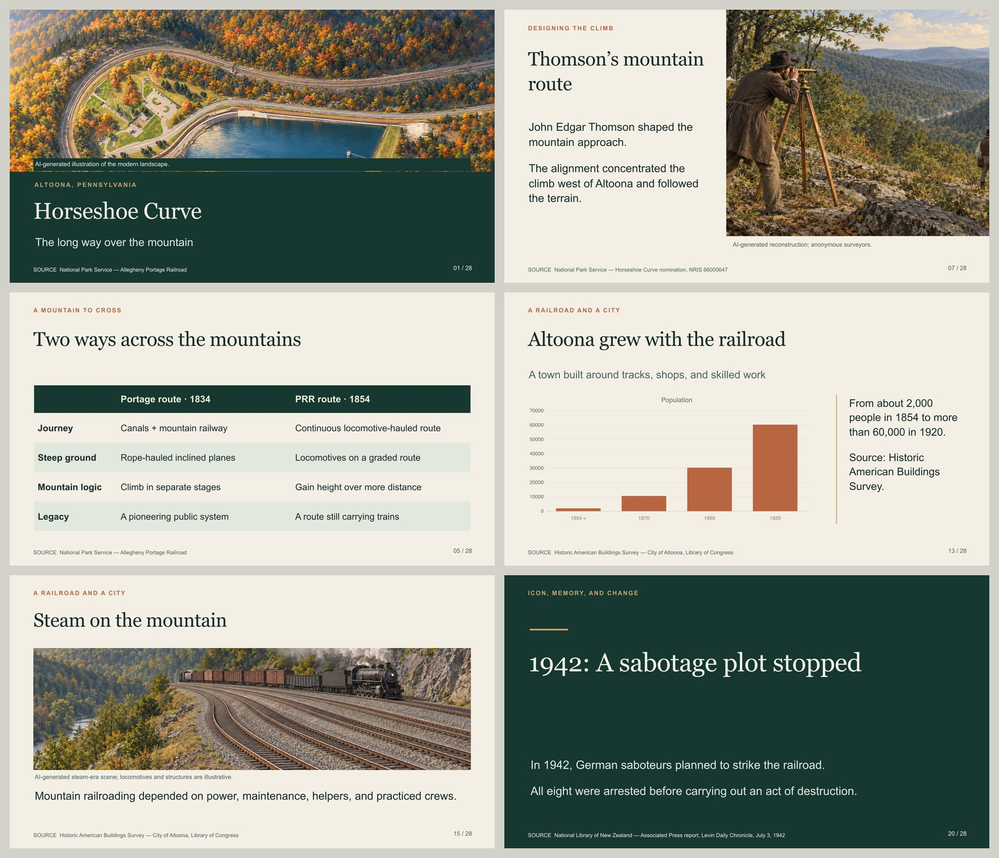
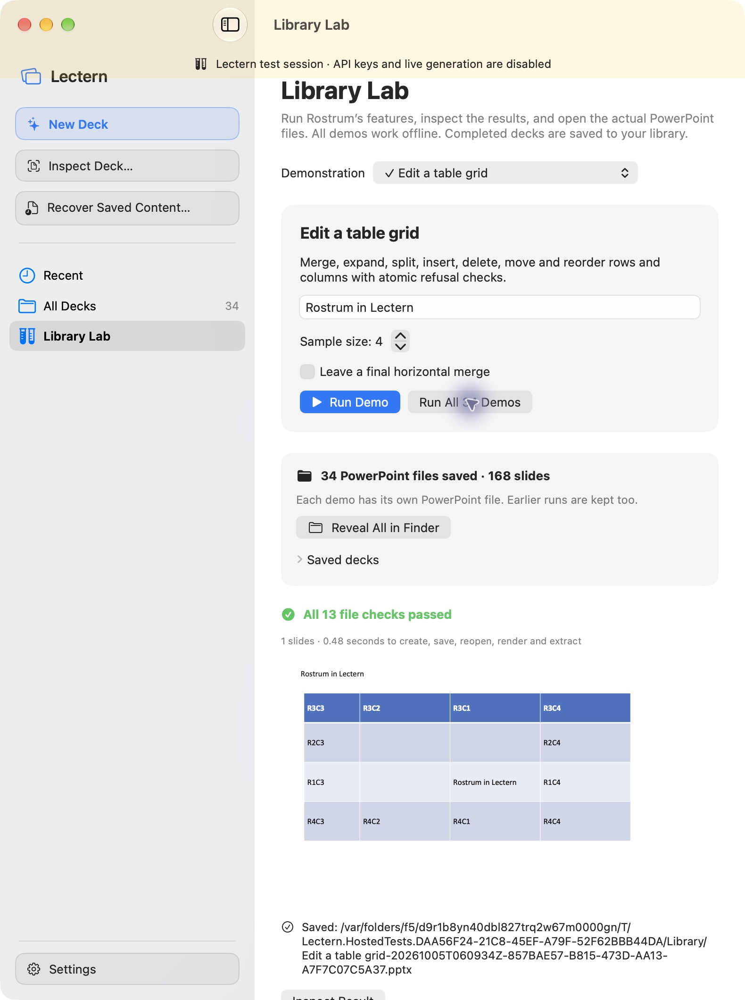
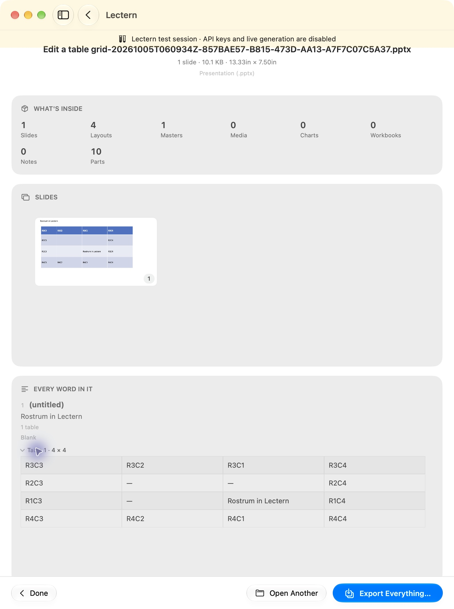
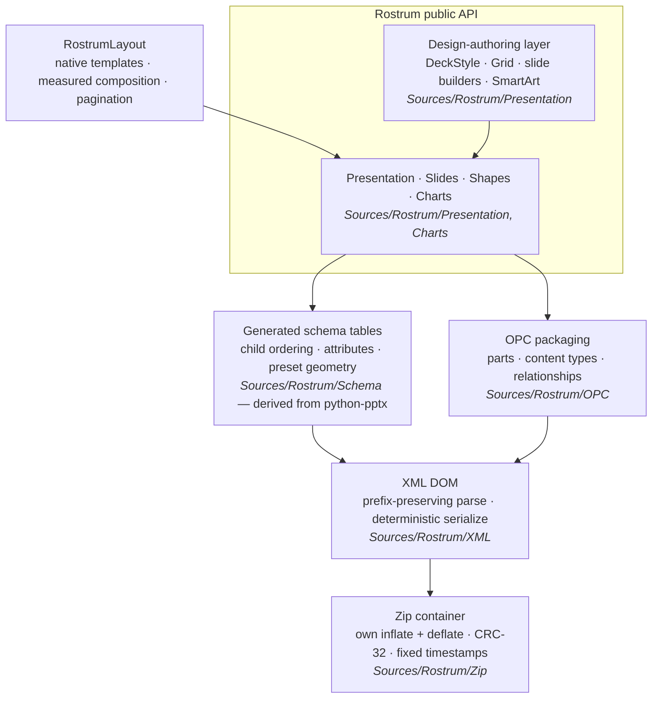
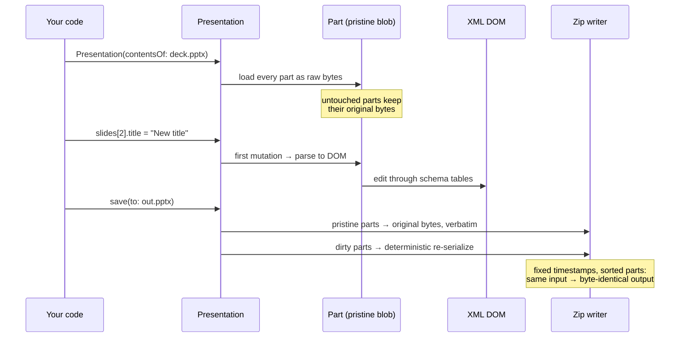

# Rostrum

[](https://github.com/welshofer/rostrum/actions/workflows/ci.yml)
[](https://swift.org)
[](#install)
[](LICENSE)

A **pure-Swift, zero-dependency** toolkit for creating, editing, composing and
previewing PowerPoint (`.pptx`) files. Rostrum owns its entire stack — from the zip container and a
hand-written DEFLATE codec, up through OPC packaging and the PresentationML
object model. It runs anywhere Swift runs: **macOS, iOS, Linux**.

Rostrum is a ground-up Swift port of
[python-pptx](https://github.com/scanny/python-pptx), whose design it follows
closely and gratefully — the layered architecture, the API shape, and the
encoded schema knowledge all trace back to that project. On that foundation
Rostrum adds capabilities outside python-pptx's current scope: slide
**remove / move / duplicate**, **modern threaded comments**, **SmartArt**
creation and text extraction, **deck merge**, **theme / brand-kit editing**,
and lossless byte-identical round-trips of the parts you don't touch.

## Two libraries, one document model

| Product | Use it for |
| --- | --- |
| **`Rostrum`** | Read and save PowerPoint packages; edit slides, tables, images, notes, comments and sections; register fonts; fit rich text; render SVG previews with diagnostics. |
| **`RostrumLayout`** | Select native template layouts, measure and fill inherited placeholders, compose editable structured content, finish authored slides and paginate without dropping content. Depends on `Rostrum`. |

Both products ship in the same Swift package. The portable libraries use
Foundation and have no external package dependencies. The companion
[Lectern app](Lectern/README.md) demonstrates the libraries on macOS and iOS;
its **34 offline Library Lab demos** save PowerPoint decks you can inspect.

Start with [Getting started](docs/GETTING-STARTED.md) for installation, file I/O,
tables, templates and preview diagnostics. See [Layout engine](docs/LAYOUT-ENGINE.md)
for measurement and composition in depth.

For a full worked example, explore **[Horseshoe Curve](Examples/HorseshoeCurve/)**:
a researched, illustrated 28-slide presentation made entirely with **Swift,
Rostrum and RostrumLayout**. The saved PowerPoint, complete builder, slide content,
generated images and source citations are included. It demonstrates editable
charts and tables, varied layouts, image crops, speaker notes, comments and sections.

[](Examples/HorseshoeCurve/)

## Create a presentation

<!-- snippet:quickStart -->
```swift
import Foundation
import Rostrum

let deck = try Presentation()                       // starts with one blank 16:9 slide
let slide = try deck.slides.add(clonedFrom: deck.layout(type: "title")!)
slide.title?.textFrame?.text = "Hello, Rostrum"
try deck.slides.remove(at: 0)                       // drop the blank starter slide
try deck.save(to: URL(filePath: "hello.pptx"))
```
<!-- /snippet:quickStart -->

### Author from a design system

Apply a `design.md` to a new presentation and build a deck with high-level slide
builders. For a native PowerPoint template, use
[`Presentation.fromTemplate(data:)` and `RostrumLayout`](docs/GETTING-STARTED.md#compose-from-a-powerpoint-template)
to preserve the template's own layout and typography.

<!-- snippet:designAuthoring -->
```swift
import Foundation
import Rostrum

let deck = try Presentation()   // or open your brand template: Presentation(contentsOf: URL(filePath: "brand.potx"))
deck.applyDesign(try Design(contentsOf: URL(filePath: "sunflower.md")))

let arr = ChartData(categories: ["Q1", "Q2", "Q3", "Q4"],
                    series: [ChartData.Series(name: "ARR", values: [12.1, 14.6, 16.8, 18.4])])

try deck.titleSlide("Q3 Business Review", subtitle: "Northwind", kicker: "FY26")
try deck.bulletSlide("Highlights", ["ARR $18.4M", "Retention 91%", "NPS 47"], kicker: "Results")
try deck.chartSlide("Revenue", .line, arr, options: ChartOptions(legend: .bottom))
try deck.setSections([("Cover", 0), ("The Quarter", 1)])
try deck.footer("Confidential").showSlideNumbers()
try deck.slides.remove(at: 0)   // drop the blank starter slide
try deck.save(to: URL(filePath: "review.pptx"))
```
<!-- /snippet:designAuthoring -->

(A ready-made `sunflower.md` ships in `Lectern/App/Resources/Styles/`, along
with 149 more.)

More recipes in the [cookbook](docs/COOKBOOK.md).

## Install

Requires **Swift 6.0+**, with macOS 13+, iOS 16+ or Linux. Add the package and
choose the products your target uses:

```swift
// Package.swift
.package(url: "https://github.com/welshofer/rostrum", from: "1.0.0")

// In your target's dependencies:
.product(name: "Rostrum", package: "rostrum"),
.product(name: "RostrumLayout", package: "rostrum")
```

The [complete package example](docs/GETTING-STARTED.md#install-with-swift-package-manager)
is ready to copy. Version 1.0 includes the layout product and the imported-deck
fidelity work described here; see the [changelog](CHANGELOG.md) for release details.

## Layout and fidelity in 1.0

The shared text engine resolves inherited formatting, registered font faces,
line breaks, spacing, tabs, list markers and vertical anchors. Fitting and SVG
previews use the same rich-text geometry. `RostrumLayout` adds template selection,
readable fit constraints, measured object captions and lossless text partitioning.

Table previews resolve native and embedded custom styles, padding, vertical
alignment, fills and supported border joins. Newly authored table cells center
text vertically by default; imported cells retain their saved alignment.
Image handling includes picture crops and selected image fills whose relationships
are resolved from the owning slide, layout, master, theme or table-style part.
Speaker notes, comments and sections remain part of the editable document model.

Document preservation, editing and visual rendering have separate acceptance
criteria. Unmodeled content in untouched package parts is preserved even when a
preview cannot draw it. A structured fidelity report exposes known omissions,
approximations and missing resources; strict rendering rejects those known gaps.
It does not certify universal PowerPoint equivalence. The
[conformance matrix](docs/CONFORMANCE.md) records the operation-level boundaries.

Start with [Importing and previewing](docs/IMPORTING-AND-PREVIEWING.md) for explicit
font registration, measured fallback and diagnostic handling. The
[layout-engine guide](docs/LAYOUT-ENGINE.md) covers native glyph placement,
table context, template scoring, pagination and cache lifetimes.

## See it in Lectern

Lectern is the working integration of both products: choose a template, run an
offline demo, inspect its generated slides, and reveal the saved `.pptx` on disk.
Each demo has its own result and saved deck; multi-slide demos retain every slide.
The Library Lab also exposes checks and support boundaries for the exercised API.





Screenshots show an isolated offline test session. The 1.0 release includes
[34 saved demo decks containing 168 slides](https://github.com/welshofer/rostrum/releases/download/v1.0.0/rostrum-v1.0.0-demo-decks.zip)
for independent inspection. The [validation receipt](docs/RELEASE-1.0-VALIDATION.md)
also records the native PowerPoint table check.

See the [Lectern guide](Lectern/README.md) and
[Library Lab coverage record](docs/LIBRARY-LAB-20261002.md) for the runnable catalog,
file persistence and end-to-end verification.

## What it can do

| Area | Highlights |
|---|---|
| **Slides** | add, remove, **move, duplicate**, layouts & placeholder inheritance |
| **Shapes** | 178 preset geometries for authoring; bounded custom line/curve previews, transforms, rotation and hidden-shape handling |
| **Fills & lines** | solid, alpha, multi-stop gradients, outlines, soft shadows |
| **Text** | paragraphs, runs, fonts, sizes, colours, alignment, spacing, tracking, **bullets, numbered lists, hyperlinks** |
| **Pictures** | PNG/JPEG/GIF sniffing, content dedup, crop read/edit, isolated replacement, stretch/tile mapping, picture rotation/reflection and geometry clipping |
| **Tables** | centered text in new cells, explicit vertical alignment, merge inspection/unmerge, row/column insertion, removal and reordering, edge/diagonal borders, padding, image fills, embedded/custom style resolution |
| **Charts** | bar / line / pie / area / doughnut / scatter / **radar / bubble / combo**, stacked & multi-series, titles, **data labels**, axis control, embedded Edit-Data workbook |
| **Chart editing** | `deck.charts` reads any deck's charts; `replaceData` swaps every cache and the workbook or **refuses without writing a byte**; `addSeries` / `removeSeries` |
| **Rendering** | `renderSVG(slideAt:)` / `exportSVG` — deterministic SVG previews with shared rich-text layout and master/layout inheritance; structured fidelity reports and opt-in `strictRendering` reject known gaps |
| **SmartArt** | Basic Block List creation; **text extraction from any diagram**; bounded preview of saved drawing caches |
| **Comments** | modern threads/replies, text editing, resolve/reopen/delete, slide/shape/text anchors; legacy comment read/create/edit/delete |
| **Notes** | rich speaker notes, independent duplicates, source notes-master preservation on import; bounded notes-page SVG previews with fidelity diagnostics; incompatible masters are refused atomically |
| **Fonts** | distinct regular/bold/italic faces, TTF/OTF embedding, bounded Swift kerning/ligature shaping with diagnostics for unsupported scripts; permitted registered fonts are embedded in SVG; explicit measured preview fallback with missing-font diagnostics |
| **Text fitting** | `shape.fitText(fonts: deck.fonts)` — shared mixed-run layout measures registered faces and writes computed `normAutofit`; inspect `renderSVGReportingProblems` for unsupported script/layout cases |
| **Theme** | read/edit palette & fonts; resolve `schemeClr` → RGB |
| **Merge** | import a slide from another deck with its images, charts and layout intact |
| **Design layer** | `DeckStyle` (type scale, WCAG auto-contrast, tokens); one-call slide builders; cards/buttons/kickers/stat tiles; a Grid DSL |
| **Templates** | lossless `.potx`/`.ppsx` round-trip; `Presentation.fromTemplate(data:)` creates a new deck retaining masters, layouts, themes and their assets; `RostrumLayout` fills inherited placeholders and checks fit; `design.md` can compile into a native master and subordinate layouts |
| **Extraction** | `deck.outline()` — every slide's text (title, subtitle, bullets with outline level, table cells, SmartArt, notes) as a value type; `DeckExport.write` unpacks a deck to a folder: one Markdown file plus per-slide media and one CSV per chart |
| **Sections** | native sections, membership maintained across slide lifecycle operations, section removal/reordering; footers, slide numbers, dates via live fields |
| **Tooling** | `pptx-tool inspect`/`validate` — schema lint; `extract` — Markdown + media + chart CSVs; `render` — SVG with fidelity diagnostics and `--strict`; separate Office/visual conformance gates |

Read/edit/preservation support and preview fidelity are separate claims. See the
[operation-level conformance matrix](docs/CONFORMANCE.md) for evidence and open
acceptance gaps. Animation is outside the current accuracy/performance work.

## Design

Rostrum is a **pristine-DOM hybrid**: a mutable XML DOM is the storage layer,
and parts keep their **original bytes until first mutation**, which makes
lossless round-trips a structural guarantee rather than an aspiration. Typed
Swift facades read and write through to the DOM, with schema-ordering tables
mechanically extracted from python-pptx's own declarations
(`Tools/rostrum-gen`). Full rationale in
[`docs/ARCHITECTURE.md`](docs/ARCHITECTURE.md); roadmap in
[`ROADMAP.md`](ROADMAP.md).

Layers, bottom to top (dependencies point strictly downward — Zip knows
bytes, XML knows trees, OPC knows parts and never slides):


```mermaid
flowchart TB
    L["RostrumLayout<br/>native templates · measured composition · pagination"]
    subgraph API["Rostrum public API"]
        P["Presentation · Slides · Shapes · Charts<br/><i>Sources/Rostrum/Presentation, Charts</i>"]
        D["Design-authoring layer<br/>DeckStyle · Grid · slide builders · SmartArt<br/><i>Sources/Rostrum/Presentation</i>"]
    end
    S["Generated schema tables<br/>child ordering · attributes · preset geometry<br/><i>Sources/Rostrum/Schema</i> — derived from python-pptx"]
    O["OPC packaging<br/>parts · content types · relationships<br/><i>Sources/Rostrum/OPC</i>"]
    X["XML DOM<br/>prefix-preserving parse · deterministic serialize<br/><i>Sources/Rostrum/XML</i>"]
    Z["Zip container<br/>own inflate + deflate · CRC-32 · fixed timestamps<br/><i>Sources/Rostrum/Zip</i>"]

    L --> P
    D --> P
    P --> S
    P --> O
    S --> X
    O --> X
    X --> Z
```

| Layer | Location | python-pptx counterpart |
|---|---|---|
| Zip container (read/write, own inflate + deflate) | `Sources/Rostrum/Zip` | Python's `zipfile` |
| XML DOM (parse/serialize, prefix-preserving) | `Sources/Rostrum/XML` | `lxml` |
| OPC packaging (parts, content types, relationships) | `Sources/Rostrum/OPC` | `pptx.opc` |
| Generated schema tables | `Sources/Rostrum/Schema` | `pptx.oxml` descriptors |
| PresentationML object model | `Sources/Rostrum/Presentation`, `Charts` | `pptx.parts` + API |
| Template composition and pagination | `Sources/RostrumLayout` | Separate Swift-native product |

And the life of a document — the pristine-DOM hybrid at work:


```mermaid
sequenceDiagram
    participant U as Your code
    participant P as Presentation
    participant Part as Part (pristine blob)
    participant DOM as XML DOM
    participant Zip as Zip writer

    U->>P: Presentation(contentsOf: deck.pptx)
    P->>Part: load every part as raw bytes
    Note over Part: untouched parts keep<br/>their original bytes
    U->>P: slides[2].title = "New title"
    P->>Part: first mutation → parse to DOM
    Part->>DOM: edit through schema tables
    U->>P: save(to: out.pptx)
    P->>Zip: pristine parts → original bytes, verbatim
    P->>Zip: dirty parts → deterministic re-serialize
    Note over Zip: fixed timestamps, sorted parts:<br/>same input → byte-identical output
```

## Examples

Runnable sample decks live in `Examples/`, each emitted entirely in Swift and
each with a job:

| Example | Slides | What it shows |
|---|---|---|
| [HorseshoeCurve](Examples/HorseshoeCurve/) | 28 | Full worked example with a saved deck, generated illustrations, 13 layout treatments, editable charts/tables, source-backed notes, comments and sections; authored entirely with Swift, Rostrum and RostrumLayout |
| `ClimateDeck` | 15 | The showpiece — a data-driven briefing: stat callouts, charts, a full visual system |
| `FlexDeck` | 13 | The API tour — one capability per slide (charts, process, cards, comments, SmartArt…) |
| `SunflowerDeck` | 30 | A production-scale illustrated deck; pass an images directory for full-bleed photography |
| `ReadmeSnippets` | — | This README's two code snippets, compiled and run by CI so the docs can't rot |

```sh
swift run ClimateDeck out.pptx
swift run SunflowerDeck out.pptx path/to/images
swift run ReadmeSnippets            # writes hello.pptx + review.pptx
swift run --package-path Examples/HorseshoeCurve/Builder HorseshoeDeck # macOS: rebuilds the included worked example
```

## Verification and performance

The test suites cover archive validity, preservation of untouched parts,
relationship integrity, saved-file reopening, layout geometry and deterministic
output. Linux CI builds Swift 6.0 and runs the full suites on Swift 6.1; macOS PR
checks exercise the Darwin implementations and compile Lectern. Local app and
PowerPoint checks add consumer evidence beyond those package tests.

```sh
swift test
swift test --package-path Lectern
python3 scripts/readme-snippets.py
```

The full local acceptance workflow is documented in
[Contributing](CONTRIBUTING.md). Native PowerPoint comparisons, SVG/browser
checks and structural lint establish different facts; a passing unit test or
an issue-free preview alone does not establish pixel equivalence.

Performance reports retain workload, source revisions, font inputs and output
checks. A historical 22-slide checkpoint measured **57.30 → 47.85 ms** warm SVG
rendering (16.5% lower); a separate 2,000-cell registered-font checkpoint measured
**67.71 → 64.82 ms**. These are distinct local comparisons, not cumulative release
speedups. Some richer fidelity paths are slower, and lower overall memory use
has not been established. Read the [performance ledger](docs/PERFORMANCE.md)
for the raw records, adverse results and reproduction instructions.

## Documentation

| Guide | Contents |
| --- | --- |
| [Getting started](docs/GETTING-STARTED.md) | Package setup, save/reopen, editable tables, native templates and preview reports |
| [Layout engine](docs/LAYOUT-ENGINE.md) | Rich-text geometry, measurement adapters, composition, pagination and table context |
| [Cookbook](docs/COOKBOOK.md) | Focused document-editing and authoring recipes |
| [Importing and previewing](docs/IMPORTING-AND-PREVIEWING.md) | Fonts, inherited artwork, fallback and diagnostics |
| [Architecture](docs/ARCHITECTURE.md) | Module boundaries, pristine parts, XML mutation and deterministic saving |
| [Format support](docs/FORMAT_SUPPORT.md) / [Conformance](docs/CONFORMANCE.md) | Read, edit, preservation and preview support, with evidence limits |
| [Performance](docs/PERFORMANCE.md) | Reproducible measurements and open costs |
| [Lectern](Lectern/README.md) | App setup, templates, saved decks and offline demonstrations |
| [1.0 validation](docs/RELEASE-1.0-VALIDATION.md) / [Publication audit](docs/RELEASE-1.0-AUDIT.md) | Release checks, native table evidence, demo downloads and publication hygiene |
| [Security policy](SECURITY.md) | Supported versions and private vulnerability reporting |

## Security

Please report suspected vulnerabilities privately through
[GitHub Security Advisories](https://github.com/welshofer/rostrum/security/advisories/new),
not as public issues. See the [security policy](SECURITY.md) for supported
versions, scope and disclosure guidance.

## Acknowledgments

Rostrum exists because [python-pptx](https://github.com/scanny/python-pptx)
exists. Steve Canny's library is the canonical map of the PresentationML
territory — a decade of careful schema archaeology that this project ports
rather than rediscovers. Rostrum's schema tables are mechanically derived
from python-pptx's declarations (see
[`THIRD_PARTY_LICENSES.md`](THIRD_PARTY_LICENSES.md)), and python-pptx
remains one of Rostrum's release oracles: a deck isn't considered valid until
python-pptx opens it cleanly. If you work in Python, use python-pptx — it is
mature, battle-tested, and excellent.

## License

[MIT](LICENSE). Portions derived from python-pptx (MIT, © Steve Canny) — see
[`THIRD_PARTY_LICENSES.md`](THIRD_PARTY_LICENSES.md). Contributions welcome —
see [`CONTRIBUTING.md`](CONTRIBUTING.md).
