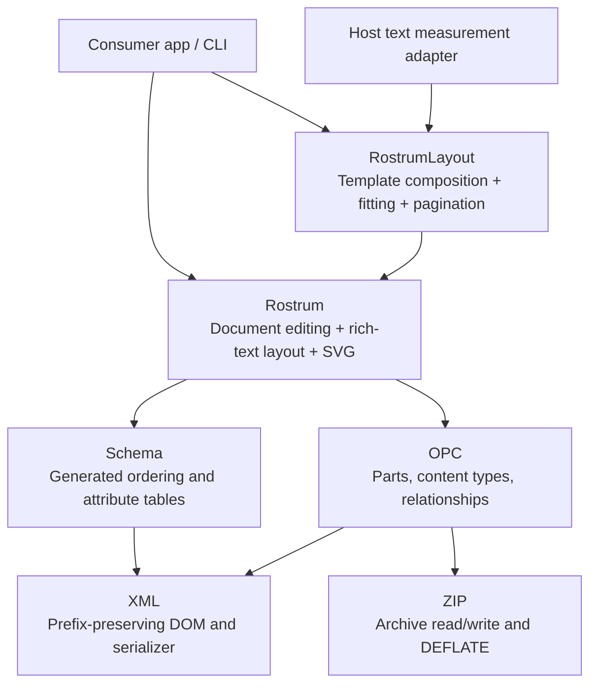
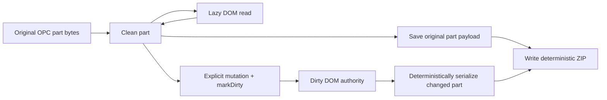

# Rostrum architecture

Rostrum 1.0 uses a **pristine-DOM hybrid**: original part bytes are preserved
until an explicit mutation, and typed Swift facades operate on the XML tree.
`Rostrum` owns document data and rendering; `RostrumLayout` owns composition.
The [roadmap](../ROADMAP.md) tracks future work rather than current guarantees.

## The one-sentence version

A mutable XML DOM is the storage layer — parts keep their **original bytes
untouched until first mutation** — and the public API is typed Swift facades
that read and write through to the DOM via a generated schema stratum.

## Why this design

- **Lossless round-trip becomes structural, not aspirational.** A part that
  was never touched is re-emitted from its pristine bytes. Open-then-save with
  no edits must produce byte-identical zip entries — a mechanical CI gate with
  zero judgment calls, and with no exceptions: `.rels` parts and
  `[Content_Types].xml` keep their original bytes too, and rebuild only when
  a relationship or content-type actually changes.
- **The serializer's blast radius is only what the user edited.** "PowerPoint
  wants to repair this file" bugs come from re-serializing parts you didn't
  need to touch. (python-pptx re-serializes every part on save — a perfectly
  reasonable design; byte-identity is simply a different goal.)
- **Typed facades give Swift-native ergonomics** without betting losslessness
  on typed structs modeling 100% of a gigantic schema (the fully-typed
  proposal's fatal flaw: every unmodeled sibling is a distributed data-loss
  hazard).

## Products and dependency boundaries



| Directory or target | Owns | Must not own |
| --- | --- | --- |
| `Sources/Rostrum/Zip` | Archive bytes, CRC, compression and deterministic packaging | XML or slide semantics |
| `Sources/Rostrum/XML` | XML trees, attribute tokens, namespace prefixes and serialization | Presentation layout |
| `Sources/Rostrum/OPC` | Part blobs, content types and relationship graph | Shapes, slides or visual fit |
| `Sources/Rostrum/Schema` | Generated schema knowledge and DOM ordering helpers | Host frameworks or composition policy |
| `Sources/Rostrum/Presentation`, `Charts`, `Fonts` | Public document model, styles, font metrics, text geometry and SVG preview | App storage, font discovery or provider access |
| `Sources/RostrumLayout` | Template candidate selection, measured fit, structured content and pagination | ZIP/XML implementation or app credentials |
| `Lectern/Sources/LecternCore` | Example application pipeline, inspection, storage and portable demos; guarded Apple adapters | SwiftUI app lifecycle |
| `Lectern/App` | SwiftUI workflows, user-selected files, Keychain integration and platform previews | Core document format implementation |

The ZIP/XML/OPC/schema/document layers are directories in the **single `Rostrum`
SwiftPM target**, not separate package products. `RostrumLayout` is a separate
target and public product depending on `Rostrum`. Neither has external Swift
package dependencies. The portable implementation uses Foundation and the Linux
FoundationXML bridge; Apple-only app adapters stay outside those products.

## Layout and composition

The separate `RostrumLayout` product depends on `Rostrum` and owns native-template
selection, measured composition, authored-slide finishing and pagination.
`Rostrum` owns the shared read-only rich-text geometry used by fitting and SVG,
explicit font registration and bounded shaping. Hosts supply platform measurement
adapters; the portable layer does not discover fonts or access providers.

See [Layout engine](LAYOUT-ENGINE.md) for component boundaries, inheritance,
line metrics, candidate scoring, cache behavior, recent fixes and validation
limits. [Importing and previewing](IMPORTING-AND-PREVIEWING.md) documents the
font fallback API and the distinction between preservation and visual fidelity.

```mermaid
sequenceDiagram
    participant H as Host application
    participant L as RostrumLayout
    participant D as Rostrum document
    participant M as Measurement adapter
    H->>D: fromTemplate(POTX data)
    D-->>H: PPTX with retained template library
    H->>L: plan(exact content, layout constraints)
    L->>D: Read native placeholders and defaults
    L->>M: Measure candidate text at usable widths
    M-->>L: Heights in points
    L-->>H: Plan with frames, font scales and reasons
    H->>L: compose(plan, same content)
    L->>D: Add slide, fill native text placeholders
    H->>D: Add objects; validate bindings; save
```

`TemplateLayoutEngine.compose` fills text; the host inserts the chosen objects.
`StructuredLayout` is one optional object composer. `MeasuredPaginator` returns
ordered content partitions; the host owns continuation slides and document
context. A measurement adapter controls composition measurement but does not
replace the separate read-only `RichTextLayout` algorithm used by SVG and explicit
shape fitting.

## Document lifecycle and mutation



A read can materialize a DOM without making it authoritative for saving. A clean
part retains its original payload even after inspection. Once an edit marks a
part dirty, its DOM is serialized on save; untouched sibling parts still retain
their original payloads. Relationships and content types follow their own dirty
state so editing one slide does not require rewriting every package entry.

Payload preservation and archive identity are different contracts. Opening and
saving an unchanged foreign file preserves decoded member payloads; the original
producer's ZIP timestamps, member order and compression choices may differ from
Rostrum's deterministic writer. Repeated equivalent Rostrum saves use fixed
timestamps, stable ordering and deterministic compression.

## Load-bearing mechanisms

**Pristine-until-mutated.** Every `Part` holds its original blob and a dirty
flag. Facades parse the blob into a DOM lazily; the first actual mutation
flips authority to the DOM. Save re-emits pristine bytes for clean
parts and serializes the DOM for dirty ones. DOM-writing facades call `markDirty()`; relationship changes and content-type
changes maintain their corresponding dirty state. Tests check that these
representations remain coherent after edits, saves and reopens.

**Generated schema stratum.** python-pptx's `xmlchemy` synthesizes accessors
at class-creation time (`RequiredAttribute`, `ZeroOrOne("p:sldSz",
successors:…)`, choice groups). Swift can't do runtime synthesis; the
equivalent is `rostrum-gen`, a standalone generator (not a macro, not a build
plugin — consumers see zero deps, generated code is diffable) whose input
tables are mechanically extracted from python-pptx's descriptor declarations
by Tools/extract-schema.py. Semantics to preserve exactly:
get-or-add for optional children, successor-list insertion order, choice-group
replacement, typed attribute conversion with default-elision. The generator
currently emits tables, not per-element typed accessors. Typed accessors and
an exclusions manifest for manual extensions remain future architecture;
there are no CT_Foo+Manual.swift files today.

**Accessors are plain computed properties** over shared generic runtime
primitives — not property wrappers (they need stored properties), not
keypaths. Boring and greppable.

**Preserve unknown content, report malformed input.** Unmodeled XML remains
in the DOM or pristine part bytes. Malformed input may throw; best-effort
inspection records failures. Write helpers preserve schema ordering and
refuse edits they cannot perform safely.

**Lexical attribute discipline.** The DOM keeps the original source token for
every attribute; typed getters parse on read, and only a genuine set replaces
the token. An untouched `rot="0"` re-emits exactly as read, even in a dirty
part.

**Orphan preservation.** Zip members unreachable from the relationship graph
are preserved on save (a stricter posture than python-pptx, which
re-packages only reachable parts). What a read could *not* keep is reported:
`deck.readWarnings` names any carried entry that failed to decode and was
dropped, rather than letting it vanish silently. A general orphan-audit API
and an opt-in `prune()` are intended but **not yet implemented**.

**Slide access.** `deck.slides[index]` and `slide(at:)` use zero-based positions
and throw if the position or relationship is invalid. Positions change after
reordering/deletion. Stable handles keyed by OOXML IDs remain a planned API;
do not pass an OOXML slide ID to the positional subscript.

## Relationship graph semantics (ported from python-pptx, kept)

- rIds are the join table between part XML (`r:id`, `r:embed`) and the part
  graph; mint the lowest free `rIdN`; dedupe `relate_to` by
  (type, target, mode); reference-counted drop (only remove a rel when its
  last `r:id` reference goes).
- Slide order lives in `p:sldIdLst`; z-order lives in `p:spTree`; identity
  lives in the rels graph. All views derive from XML on every access.

## Fidelity and resource ownership

SVG rendering is a read-only consumer of the document model. It resolves the
slide → layout → master → theme chain, obtains detached effective text styles,
and uses `RichTextLayout` for the supported geometry. The renderer collects
fidelity diagnostics for missing resources, approximations and omissions.
Document validation and preview diagnostics remain separate: a valid package
can contain a feature the preview cannot draw.

Image relationship IDs are local to their owning part. A selected theme fill,
for example, must resolve its image from the theme's relationships rather than
the slide's. Inspection/export and rendering retain that owner while resolving
selected direct and inherited resources. The same distinction applies to
inherited table styles and background artwork. External image relationships
produce diagnostics without automatically fetching remote content.

Font registration is explicit. Registered faces supply metrics and permitted
preview font data; source typeface names remain part of the document. A preview
fallback is a host choice with diagnostics, not an implicit rewrite of those
names. Native complex-script and full PowerPoint rendering equivalence remain
outside the published bounds.

## Performance and cache lifetimes

The preservation model avoids serializing unchanged XML. Repeated saves can
reuse bounded compression results, and rendering uses operation-scoped resolved
styles and resource lookup caches. Template measurement caches belong to an
engine instance and depend on a stable measurement adapter/font environment.
Changing those inputs requires a fresh engine. No cache authorizes a stale
render after a document edit.

The [layout guide](LAYOUT-ENGINE.md#performance-and-determinism) describes the
specific measurement/font cache bounds. The [performance ledger](PERFORMANCE.md)
retains exact workloads, baselines, output checks and known regressions. Reduced
allocation in one phase is not a claim of lower whole-process memory use or
faster rendering for every document.

## Testing and acceptance

| Evidence | Establishes | Does not establish |
| --- | --- | --- |
| ZIP/XML/OPC and public API suites | Archive validity, expected edits, relationship integrity, preservation and deterministic output for tested cases | Complete Office visual behavior |
| python-pptx, system ZIP and zlib oracles | Independent reopening/decompression and schema semantics for exercised fixtures | Native typography or pixel equivalence |
| Rich-text, template and pagination tests | Geometry and fit rules, explicit failures and retained content | Every installed font or script |
| LecternCore and app integration tests | Recipe outputs, saved-file checks, inspector/export behavior and selected UI paths | Untested live providers or native PowerPoint behavior |
| PowerPoint open/export and browser comparisons | Native/consumer evidence for the recorded specimens and environment | Universal feature coverage |
| Matched Release benchmarks | Measured phase costs on fixed inputs, with output preservation where recorded | Cumulative release speedups across different baselines |

The schema tests port the field-tested semantics of python-pptx's successor
ordering, get-or-add, choice replacement and default elision. The generated
tables retain their MIT attribution in [THIRD_PARTY_LICENSES.md](../THIRD_PARTY_LICENSES.md).

Run `swift test` for both library products and `swift test --package-path Lectern`
for the app core. See [Contributing](../CONTRIBUTING.md) for the complete local
gate, isolated app testing and native acceptance. Build products and test hosts
must stay isolated from an active user demo; tests use injected/disabled
credential stores instead of changing production Keychain entries.

## Known deviations from python-pptx (deliberate)

- Default new deck is 16:9 built from inspectable XML constants (theirs: 4:3
  bundled binary `default.pptx`).
- Pure-Swift fixed-Huffman/LZ77 DEFLATE on write when it saves space;
  already-compressed media can remain STORED. Both paths are deterministic.
- Unreachable parts survive save (see orphan preservation).
- `Presentation.package` is public — the OPC escape hatch is a feature.
