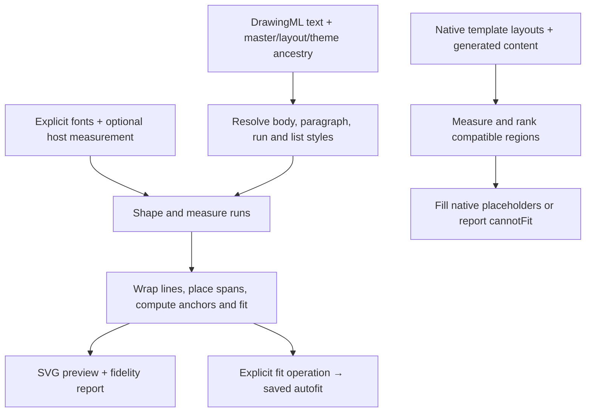

# Layout engine

Rostrum separates document layout from slide composition. The shared text engine
measures existing DrawingML for fitting and previews. The `RostrumLayout` product
chooses and fills native template regions or finishes slides authored from a
design system. Neither is a replacement for PowerPoint's complete layout engine.

This guide describes the imported-fidelity and native glyph-placement updates. Read it with the [preview guide](IMPORTING-AND-PREVIEWING.md),
[format support matrix](FORMAT_SUPPORT.md) and [conformance record](CONFORMANCE.md).

## Components and responsibilities

| Component | Responsibility | Mutation boundary |
| --- | --- | --- |
| `RichTextLayout` in `Rostrum` | Resolve inherited rich text, shape and measure runs, break lines, place spans and compute occupied height and fit | Read-only geometry and diagnostics |
| `FontLibrary`, `FontMetrics`, `TextShaper` | Explicit face registration, advances and bounded shaping; optional host measurement and measured preview fallback | Registration changes the host's font registry, not source typeface names |
| `shape.fitText(fonts:)` | Use shared rich-text geometry to compute saved normal autofit | Explicit editing operation; writes computed fit settings |
| `SVGRenderer` | Draw resolved content using text geometry and collect fidelity issues | Read-only preview; does not repair or relayout the saved document |
| `TemplateLayoutEngine` in `RostrumLayout` | Evaluate native layouts, measure content, score compatible candidates and fill placeholders | Composes new slide content; retains the supplied master/layout/theme |
| `AuthoredLayoutEngine` in `RostrumLayout` | Check and fit design-authored text regions, then publish a reusable layout | May adjust authored typography and spacing; not used to rewrite imported templates |
| `MeasuredPaginator` in `RostrumLayout` | Partition ordered content according to a caller's actual fit predicate | Returns partitions without dropping or reordering content |

The composition adapters are distinct from `RichTextLayout`. They can accept a
`TextHeightMeasurer` supplied by the host, such as Lectern's Apple measurement
adapter. Do not assume that every composition decision is made by the portable
rich-text algorithm or that a computed fit matches PowerPoint's chosen autofit.

## Shared text layout

`RichTextLayout` produces positioned lines/spans, `contentHeight`, `fits`,
`truncated` and shaping diagnostics in point coordinates. Resolution combines
local text-body properties with layout/master defaults, then resolves paragraph
levels and run properties. It accounts for insets, mixed sizes and styles,
tracking, explicit breaks, fields, supported tabs, bullets, paragraph spacing,
saved normal autofit, wrapping and vertical anchoring. The default line bound is
4,096; reaching a bound is observable through truncation rather than an
unbounded layout loop.

The imported-fidelity update fixes several interactions:

- Inherit body properties and placeholder list styles; apply all-caps before
  measuring rather than changing only the displayed glyphs.
- Keep empty-paragraph spacing without emitting a marker or advancing numbering.
  Treat bullet font/size alternatives as inheritance choice groups.
- Use the paragraph text face for automatic numbers and the configured bullet
  face for character bullets. Center/right-aligned markers move with their text.
- Separate interline pitch from final occupied height. Exact line spacing no
  longer adds a following-line gap to the final line of an anchored block.
- Keep viewer advances for adjacent unmeasured runs instead of placing each at
  an estimated absolute x coordinate. Explicit tabs, lines and list boundaries
  retain their positioning.
- Allow an explicit registered `previewFallbackFamily` so unavailable-font
  previews use the same face for measuring and drawing. Missing-font diagnostics
  and strict refusal remain; source font names are preserved.

The native acceptance record includes four title anchors improving from 9–13
pixels too high to within 0–1 pixel at 960×540. This scoped result does not certify
all fonts, scripts, line-breaking rules or native text effects.

## Template composition

`TemplateLayoutEngine.plan` filters layouts by requested content, optional master
or layout identity, usable title/body/object/picture placeholders and geometry.
It measures candidate regions before selecting one. Captions reserve measured
space alongside their objects; fixed artwork and other placeholders bound title
flow. A custom cover can use one body placeholder with separate title/subtitle
levels without flattening its source template.

The candidate score considers semantic layout preference, headline hierarchy,
required shrinking, usable content area, column balance and image aspect ratio.
Equal scores retain stable source order. `TemplateSlidePlan.score.reasons`
exposes the decision factors; `variant` selects among the ranked candidates.
Empty canvas is not itself treated as a defect.

Template autofit respects the source body's policy. Supported normal autofit
uses a bounded search and readable lower limits; eligible overflow or shape
autofit can grow a slide-local region into available space. `noAutofit` does not
mean that wrapping is forbidden. The engine does not rewrite a master to force
a candidate to fit. If no compatible candidate works, it throws
`LayoutError.cannotFit` with the relevant constraints.

Structured objects inherit the content placeholder's typeface and master palette.
Generated object typography scales with slide height relative to a 540-point
canvas. Tables, charts, diagrams and captions therefore participate in measured
composition rather than consuming arbitrary leftover rectangles.

## Authored slides and pagination

`AuthoredLayoutEngine` is the final pass for design-authored slides. It rejects
text frames outside the slide and checks occupied height within the insets.
Where needed it compacts spacing and reduces type within readable bounds,
preserving intentionally small captions. A failed fit is reported; it does not
silently discard text. `finish` fits the slide and publishes its layout.

`MeasuredPaginator.pages` accepts a deterministic, monotonic fit predicate and
finds fitting prefixes without changing their order. A single item that cannot
fit produces an error. `MeasuredPaginator.text` splits at word boundaries into
exact substrings whose concatenation reproduces the original. Cancellation is
checked during partitioning. The consumer remains responsible for creating
continuation slides and retaining notes and other document context.

## Performance and determinism

Template measurement caching is scoped to an engine and keyed by text, font,
size, bold, tracking and width. It clears at 8,192 entries; a cache miss does not
change the layout rule. Use a stable measurement adapter and font environment
for an engine's lifetime, and create a new engine after changing them or the
template layouts it evaluates.

Font-resource encoding retains at most 4 MiB of cached base64 data and invalidates
on registration. Ordered single-scalar ASCII shaping avoids unnecessary lookup
construction and sorting while retaining the general path for other input.
These are separate optimizations from candidate measurement caching.

The imported-deck checkpoint measured 16.5% lower warm library rendering time.
Other text/table benchmarks use different baselines, and some richer fidelity
paths cost more. Do not sum the percentages or infer device latency from them.
The [performance ledger](PERFORMANCE.md) preserves workloads, baselines and limits.

## Native glyph placement and table context

The calibrated left-to-right Latin profile keeps authored, measured and painted
font sizes separate. Supported runs emit explicit scalar positions without
stretching glyphs to fit a guessed width. Absent or explicit-zero resolved kerning
disables pairs in this profile; positive thresholds use the measured size.
General or unsupported runs retain their separate fallback policy. This boundary
is why cross-platform tests must embed the face they intend to measure rather
than depend on the host's installed fonts.

`RichTextLayout.Context.tableCell` selects table semantics explicitly. Cell
fitting reads current padding, table style and vertical anchor from the owning
cell, including after those properties change. The supported table path ignores
stored font scaling and measures at 100% with zero reduction; unverified stored
line reduction remains diagnosed and prevents a positive fit result. None of
these read-only calculations rewrites the saved body.

Repeated-style attribute lookup, compact scalar storage, reserved glyph capacity
and reuse of shaped line breaks reduce repeated layout work. The
[initial glyph integration record](LAYOUT-FIDELITY-20261004-9.md) and its linked benchmark
retain source revisions, independent glyph/spacing evidence and tradeoffs.
Lectern's paragraph demonstration has seven slides; the cell-appearance
example has three. Both exercise saved-file inspection and the WebKit paint path.

## Later native corrections and demonstrations

The update reconciled with `main` at `4df1c71` includes these bounded additions:

- List markers use native-calibrated sizing and continuation placement for the
  admitted profiles. Threshold-crossing sizes keep the earlier shaping path.
  The list-marker demonstration preserves the native reference specimens and
  distinguishes computed fitting from source geometry.
- Center/right alignment has native coverage for fractional origins, trailing
  spaces, hard breaks, insets, wrapping, actual faces and table context. This
  evidence expands coverage without claiming a new universal alignment algorithm.
- Mixed-face exact spacing admits distinct resources with equivalent normalized
  Windows vertical metrics. It corrects vertical origins while preserving glyph
  x positions, painted sizes and source faces. Unequal metrics, mixed-face
  percentage spacing and table contexts keep their separate fallback behavior.
- A table without an applied style renders as the native unstyled black grid;
  the style-list insertion default is not treated as an applied style. Import
  preserves absent style IDs and properties. Bounded opaque solid, unmerged LTR
  borders with unequal widths use surviving perpendicular edges to determine
  join endpoints. Later native cases extend bounded admission to axis-color
  profiles, partial custom styles and unmerged LTR collinear color/width
  transitions. Explicit empty edges, noFill and direct overrides retain their
  distinct behavior; missing effective cardinal edges in resolved custom styles
  receive native black 1 pt defaults without rewriting authored XML.
- Selected image-fill inventory retains the owning slide, theme or style part
  while resolving relationships. Shape/table fills, backgrounds and active
  inherited furniture contribute selected resources to inspection and export.
  Direct overrides suppress inherited selections; unresolved or external
  resources produce deterministic warnings without fetching remote content.

Ordered glyph-range assembly, indexed cell lookup, resolving only live cell text
styles, operation-local marker parsing and reuse of ordinary inherited SVG
attributes reduce repeated work. These changes preserve their own measured
baselines and admission rules. See [performance measurements](PERFORMANCE.md).

Lectern has 34 offline recipes, including native list markers, text alignment,
mixed-face spacing, table defaults, join profiles, partial custom styles,
border transitions and image ownership. Each uses saved-file checks and the
inspector/export paths. The [table transitions record](LAYOUT-FIDELITY-20261004-21.md),
[partial styles record](LAYOUT-FIDELITY-20261004-19.md) and
[image inventory record](LAYOUT-FIDELITY-20261004-22.md) distinguish source,
native, browser and manual acceptance. Later image-inventory integration has
standalone AppState evidence; fresh native UI acceptance and comparative
image-inventory performance remain deferred in that record.

Acceptance remains bounded. Marker comparisons retain six explicit omissions;
computed-fit pages do not prove native autofit choices. Colored RTL/merged
combinations, dashed or translucent transitions and compound borders retain
separate fallback paths. Neither workflow checks nor the native specimens
establish complete table or whole-slide equivalence. The
[publication receipt](PUBLICATION-HYGIENE.md) distinguishes upstream records
from checks rerun on this documentation and privacy update.

## Source and verification map

- [Shared rich-text layout](../Sources/Rostrum/Presentation/RichTextLayout.swift)
  and [SVG renderer](../Sources/Rostrum/Presentation/SVGRenderer.swift).
- [Font registry](../Sources/Rostrum/Fonts/FontLibrary.swift) and
  [shaping](../Sources/Rostrum/Fonts/TextShaper.swift).
- [Template engine](../Sources/RostrumLayout/TemplateLayoutEngine.swift),
  [authored engine](../Sources/RostrumLayout/AuthoredLayoutEngine.swift), and
  [paginator](../Sources/RostrumLayout/MeasuredPaginator.swift).
- [Imported-fidelity acceptance](IMPORTED-FIDELITY-20261003.md) and
  [operation-level conformance](CONFORMANCE.md).

Regression coverage includes rich-text layout, font faces, inherited imported
geometry, native line boundaries, template composition and pagination. Run the
complete `./scripts/verify.sh` gate and inspect native/consumer output before
claiming visual acceptance. Full complex-script, bidi, unsupported geometry and
unavailable native-font equivalence remain outside the documented guarantees.
